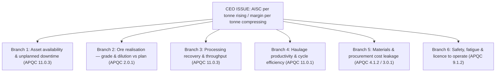

# Personas and the Value Tree

> Phase 0 of the `agentic-product-workflow` skill, applied to the 100-agent mining build.
> Named by topic rather than by phase number because this repository already numbers its own
> build phases 1–5, and the skill's phases 0–7 are a different axis entirely.

**Status:** re-root approved 2026-08-12. Persona set approved 2026-08-12 (Option 3: nine
operator personas, plus GM/COO as economic buyer, plus a CEO view).

---

## 0. What is being done backwards, and why that matters

The skill derives agents *from* personas: *"An agent that does not trace back to a JTBD pain
point does not get built."* Here the 100 agents already exist. This document is therefore a
**retrofit**, and it is written to expose the seams rather than hide them.

Two consequences follow, and both are load-bearing:

1. Any agent that cannot be traced to a named human's named pain is recorded as an **orphan**
   in §5. Orphans are not quietly assigned to the nearest persona.
2. Baselines and dollar values are **not invented**. The only citable figure available is the
   `$145k/hr` mill-downtime cost from the CEO playbook. Everything else that would need a
   number sits in the assumption ledger (§6) as a question for the client.

---

## 1. The re-rooted CEO tree

The published playbook roots Mining & Metals at *"Unplanned Mill Downtime & Ore Recovery Margin
Loss"*. Mapped against the 52 externally-callable entrypoints, that root fails the MECE bar:
roughly 25 entrypoints — the whole of safety, supply, procurement and maintenance work
management — have no branch to sit in. It also names two branches (tailings dam piezometer
breach, contractor EPC overrun) for which no data and no agent exist in this build.

Re-rooted on the metric a mining CEO is actually measured on:

**Root: All-in Sustaining Cost (AISC) per tonne.**

AISC is the industry-standard disclosure metric. It absorbs mining cost, processing cost, G&A,
sustaining capital *and* the cost of safety and environmental failure — which is precisely why
it can hold all six branches without the tree going lopsided.

| Branch | Entrypoints | Count | Primary personas |
|---|---|---|---|
| 1. Asset availability & unplanned downtime | D01–D10, S01, S02, S03 | 13 | Reliability Engineer, Maintenance Planner |
| 2. Ore realisation — grade & dilution | D16–D20, S06 | 6 | Mine Geologist |
| 3. Processing recovery & throughput | D21–D26, S07 | 7 | Metallurgist |
| 4. Haulage productivity & cycle efficiency | D11–D15, S04 | 6 | Mine Controller |
| 5. Materials & procurement cost leakage | D27–D34, S08, S09 | 10 | Supply Planner, Procurement Lead |
| 6. Safety, fatigue & licence to operate | D35–D40, S05, S10, S11 | 10 | HSE Lead, Shift Supervisor |
| **Total** | | **52** | |

`S12 — Shift Handover & Site Value Briefing` is deliberately **not** a branch. It sits *above*
the six as the convergence layer where every branch's day resolves into one narrative. That is
also the CEO/GM surface: the one screen where six streams of operational value roll up.

### Why this is MECE

- **Mutually exclusive:** each branch owns a distinct cost driver. Branch 1 is *availability of
  the asset*; Branch 4 is *productivity of the available asset*. A truck that is down belongs to
  1; a truck that is running a congested route belongs to 4.
- **Collectively exhaustive:** 52 of 52 entrypoints land in exactly one branch, and the total
  reconciles against the catalog.

### What the re-root drops

Two published branches are abandoned because nothing in this build serves them, and inventing
coverage would be the exact fabrication the skill warns against:

- **Tailings dam environmental hazard.** No piezometer data exists. `D23 Tailings Loss Analyst`
  reads `mining_data.metallurgical_recovery` — it is a *recovery-efficiency* agent and belongs
  to Branch 3, not a dam-safety agent.
- **Contractor EPC schedule overrun.** No capital-project or EPC data exists anywhere in
  `mining_data`.

Both are recorded in §6 as gaps a real engagement would need to close.

---

## 2. The persona set

Nine operator personas, split where a genuine handoff exists, plus two executive personas.

| # | Persona | Branch | Owns |
|---|---|---|---|
| 1 | Reliability Engineer | 1 | D01–D06 diagnostics |
| 2 | Maintenance Planner | 1 | D07–D10 work management, S01, S02 |
| 3 | Mine Controller | 4 | D11–D15, S04 |
| 4 | Mine Geologist | 2 | D16–D20, S06 |
| 5 | Metallurgist | 3 | D21–D26, S07 |
| 6 | Supply Planner | 5 | D27–D31, S08 |
| 7 | Procurement Lead | 5 | D32–D34, S09 |
| 8 | HSE Lead | 6 | D35–D40, S11 |
| 9 | Shift Supervisor | 6 + convergence | S05, S10, S12 |
| E1 | GM / COO (economic buyer) | all | S12 roll-up |
| E2 | CEO | all | AISC view |

**Why the three splits.** Each of these pairs is two humans, two systems of record, and a
handoff — and the handoff is where a Pattern A swarm earns its existence:

- Reliability Engineer / Maintenance Planner — S01 and S02 span the seam between *diagnosis*
  and *scheduling*.
- Supply Planner / Procurement Lead — S08 spans *stockout impact* and *sourcing*.
- HSE Lead / Shift Supervisor — S10 spans *risk detection* and *crew stand-down authority*.

Merging any pair would hide the seam and make the swarms look like decoration.

---

## 3. Swarm anatomy (what a Pattern A screen must render)

Swarms are **in-process**: coordinator, three specialists and a critic are nodes in one
`Workflow` graph inside one Cloud Run container. There is no A2A RPC. Two worked examples:

| S01 — Cascading Failure Impact & Recovery | S10 — Fatigue Intervention & Stand-down |
|---|---|
| `S01` coordinator | `S10` coordinator |
| `S01-SP1` Telemetry Anomaly Detector | `S10-SP1` Biometric Fatigue Scorer |
| `S01-SP2` Dependency Blast-Radius Tracer | `S10-SP2` Microsleep Event Escalator |
| `S01-SP3` Downtime Duration Forecaster | `S10-SP3` Shift Coverage Impact Analyst |
| `S01-CRITIC` Recovery Plan Critic | `S10-CRITIC` Intervention Critic |

Phase 2 requires a Pattern A screen to show per-agent state and handoffs. **This is now verified
as buildable.** A probe against the deployed `S01` returned 60 events whose authors were
`s01`, `s01_sp1`, `s01_sp2`, `s01_sp3` and `s01_critic` — each node authors its own events, so
per-agent state and the handoff sequence are both recoverable from the `/run` response without
any change to the agents. A swarm console is a rendering job, not a fabrication.

---

## 4. Per-persona detail

> Day in the Life, JTBD, Empathy Map and Journey Scaffolding for each of the eleven personas.
> Drafted per the templates in `agentic-product-workflow/references/personas.md`.

### Part 1: Branch 1 (Asset Availability) and Branch 4 (Haulage Productivity)

> **Authorship note — retrofit context.** These personas were drafted after the agents were built, not before. The agents were designed from operational and data-availability constraints; the personas are now being constructed to explain and justify them. This inversion is disclosed so that readers of this document — whether they are evaluating the product or forking the accelerator — know that some JTBD entries are reverse-engineered rationalisations of capability already present, not discovered user needs that drove agent selection. Where that distinction is material it is called out explicitly.

> **Citable figure.** The one externally validated cost figure in this engagement is **$145k/hr of mill downtime**. No other dollar values or percentage improvements appear in this document without the tag `[CLIENT INPUT REQUIRED]`.

---

### Persona 1: Reliability Engineer

**Role summary.** The Reliability Engineer is accountable for the mechanical health of the mine's fixed and mobile assets — SAG mills, ball mills, conveyors, crushers, and the haul fleet. The role sits at the intersection of condition monitoring, fault diagnosis, and maintenance input: the engineer decides *what is wrong* and *how urgent it is*, so the Maintenance Planner can decide *what to do about it*.

---

#### Day in the Life: Reliability Engineer

* **Shift pattern:** Typically day shift only — 6:00 to 18:00, 5-on-2-off or 4-on-3-off depending on site roster. Occasional callouts when a critical alarm fires at night. Formal handover to a senior operator or shift supervisor at 17:30; no peer-to-peer RE handover because most sites run one RE per day shift.

* **Hour-by-hour:**
  * **06:00–06:30** Arrival and overnight-alarm triage. Pulls up the SCADA/historian dashboard; reviews any alarm logs from the night. Checks whether the night shift logged anything in the maintenance system. Typically finds 10–40 alarms of varying severity, most of which are nuisance trips. Mentally filters these before the daily planning meeting.
  * **06:30–07:30** Daily planning meeting with maintenance planner and shift supervisor. RE provides condition assessment inputs: "SAG mill bearing is trending warm, keep an eye on it." "Crusher torque looks clean." These are verbal, from memory or hand-scribbled notes — not yet documented formally.
  * **07:30–09:30** Deep diagnostic work at desk: pulls historian trends for high-priority assets, runs FFT if vibration analyser software is available, checks OEM alert thresholds. This is the most cognitively demanding block. Interruptions are frequent (radio, phone from maintenance coordinator asking for written justification of a work order priority change).
  * **09:30–10:30** Field walk — physical inspection of assets flagged from the overnight data. Requires PPE transition (20–30 min round-trip to the plant, hard hat, ear protection, steel-toed boots). Connects a portable vibration analyser to bearing housings. Takes photos. Notes are on paper or a voice memo.
  * **10:30–12:00** Transcribes field notes into the CMMS (maintenance management system). Raises or escalates work orders. Writes defect reports. This is widely regarded as the most frustrating part of the role: transcription of what was already mentally known into a system that demands structured fields.
  * **12:00–13:00** Lunch; informal knowledge exchange with other engineers.
  * **13:00–15:00** Trend review for the concentrator: mill power draw, cyclone pressure, torque on the ball mill. Flags deviations. Runs any simulation scenarios if a digital twin is available.
  * **15:00–16:30** Follow-up on defects raised earlier: has the work order been scheduled? Are parts available? Chases maintenance planner or stores. Attends any ad hoc meetings triggered by a significant event (equipment damage, near-miss).
  * **16:30–17:30** Prepares end-of-shift summary. Identifies assets to watch overnight. Handover is to shift supervisor, not another RE — context transfer is lossy.
  * **17:30–18:00** Departure. Night events are handled by site operations, not RE unless escalated.

* **Systems touched:**
  * SCADA / historian (OSIsoft PI or similar) — primary source of truth for telemetry
  * CMMS (e.g., SAP PM, IBM Maximo, Infor EAM) — work order management
  * OEM condition monitoring portals (e.g., SKF @ptitude, Emerson AMS) — vibration and thermal alerts
  * Portable vibration analyser software (proprietary)
  * Microsoft Excel — for trend analysis when historian tools are too slow or inaccessible
  * SharePoint or a shared drive — for defect reports and inspection records
  * Paper and pen — field notes
  * Radio (UHF) — coordination with plant floor operators

* **Interruptions:**
  * Unplanned equipment trips requiring immediate root-cause input — occur [CLIENT INPUT REQUIRED: typical frequency] per week
  * Maintenance planner requesting written justification to elevate a work order priority
  * Operations requesting verbal clearance before taking equipment offline
  * OEM vendor calls for data to support warranty claims
  * Safety officer requesting a defect history extract for an incident investigation

* **Handover:**
  * No structured RE-to-RE handover; the outgoing RE's knowledge of developing faults lives in informal notes, CMMS comments, or memory.
  * Critical trending data is not flagged in the SCADA system in a way that the night-shift supervisor can interpret without RE training.
  * Overnight faults can worsen undetected for 8–12 hours before the next RE reviews them.

---

#### JTBD: Reliability Engineer

* **When** I notice an unusual vibration alarm during my overnight review,
* **I want to** pull the full frequency-domain signature for that asset and compare it against its historical baseline without opening the historian manually,
* **So I can** distinguish a genuine bearing fault from a transient load spike before I commit to raising a work order.
* **Current workaround:** Export time-series from historian to Excel, run a manual trend comparison, consult OEM fault frequency tables. Takes 30–90 minutes per asset.
* **Pain severity:** High — incorrect escalation wastes maintenance resources; missed escalation risks catastrophic failure costing $145k/hr of mill downtime.
* **Candidate agent:** D01 (Vibration Signature Diagnostic) — reads `telemetry_stream` (metric_name / metric_value / asset_id / timestamp long format) and returns a signature assessment.

---

* **When** I suspect a mill bearing is running hotter than normal across multiple shifts,
* **I want to** see a thermal drift trend for that asset across the last 7–14 days, with deviation from rolling baseline highlighted,
* **So I can** decide whether the trend is accelerating (schedule immediate work) or stabilising (monitor for another cycle).
* **Current workaround:** Manually query historian, paste into Excel, compute rolling average by hand.
* **Pain severity:** High — thermal progression to failure is typically nonlinear; a day's delay in escalation can double repair cost.
* **Candidate agent:** D02 (Thermal Drift Diagnostic) — reads `telemetry_stream`.

---

* **When** the crusher is showing intermittent torque spikes that don't align with feed tonnage,
* **I want to** see a torque signature overlay against crusher operating state (open/closed-side setting, bypass flag),
* **So I can** determine whether the spikes are a mechanical fault or a process control anomaly.
* **Current workaround:** Cross-references historian and the crusher PLC log manually; the crusher states table is not exposed in the historian UI.
* **Pain severity:** Medium — torque spikes are common; separating mechanical from process causes requires data integration that the RE currently does by hand.
* **Candidate agent:** D03 (Torque Signature Diagnostic) — reads `telemetry_stream` + `crusher_states`.

---

* **When** I am reviewing power draw across the mill circuit,
* **I want to** identify which assets are consuming above their efficiency band relative to the work they are doing,
* **So I can** flag candidates for a motor efficiency audit or load-optimisation adjustment.
* **Current workaround:** Computes kW per tonne manually using historian exports; no automated efficiency-band calculation exists.
* **Pain severity:** Medium — energy cost is a real operational lever, but the immediate safety risk is lower than bearing or thermal faults.
* **Candidate agent:** D04 (Power Draw Efficiency Analyst) — reads `telemetry_stream`.

---

* **When** I need to advise the Maintenance Planner on which assets to prioritise for the next shutdown window,
* **I want to** rank assets by their downstream criticality — how many other assets fail or degrade if this one goes down — so that the highest-impact assets are scheduled first,
* **So I can** give the planner a defensible priority list rather than an opinion.
* **Current workaround:** RE maintains an informal asset dependency map in their head or on a whiteboard; formal criticality ranking does not exist at most sites.
* **Pain severity:** High — without a ranked list, shutdown windows are often filled by whichever supervisor advocates loudest, not by asset risk.
* **Candidate agent:** D05 (Asset Dependency Criticality Ranker) — reads `asset_dependencies` + `assets`, traverses blast_radius graph.

---

* **When** the team wants to test a proposed maintenance intervention — e.g., changing a lubrication schedule — before implementing it on live equipment,
* **I want to** replay a digital twin simulation run to see what the predicted asset state would have been under the proposed regime,
* **So I can** justify or reject the change with evidence rather than intuition.
* **Current workaround:** If a digital twin exists, the RE submits a request to a specialist team; results come back in days. Most sites have no twin at all.
* **Pain severity:** Medium — the twin replay workflow is slow rather than absent; the pain is in turnaround time and access friction.
* **Candidate agent:** D06 (Digital Twin Simulation Replay Analyst) — reads `simulation_runs`.

---

#### Candidate orphans: Reliability Engineer

None. All six assigned agents (D01–D06) have a corresponding JTBD above.

---

#### Empathy Map: Reliability Engineer

* **SAYS:** "The alarm went off at 2 a.m. but by the time I reviewed it at six it had cleared — I can't tell if it was a real fault or a nuisance trip." / "I need three systems open at once just to answer one question." / "If that mill goes down it's $145k an hour — I can't afford to be wrong."

* **THINKS:** "I already know what's happening with this bearing. I just need the data to prove it so I can get the work order approved." / "Half my day is data wrangling, not engineering." / "Nobody reads the handover notes I leave — next shift starts from scratch every time."

* **DOES:** Manually exports historian data into Excel for trend analysis. Physically walks to the plant to validate alarms. Cross-references three or four systems to build a picture that should be integrated. Raises work orders and then chases whether they were actioned. Keeps a personal notebook of developing faults not yet in the CMMS.

* **FEELS:** Frustrated by the latency between data and decision. Anxious during periods when a critical asset is trending toward a threshold — the window for proactive intervention feels narrow and the tooling feels slow. Respected within the team for diagnostic skill but under-recognised because the value is in what *doesn't* fail.

---

#### Journey Scaffolding: Mill Bearing Thermal Event — Overnight Alarm to Work Order

* **Operational Context:** The Reliability Engineer arrives at 06:00 in the mine's engineering office — a climate-controlled room adjacent to the concentrator control room. The environment is loud (HVAC, nearby plant noise through the wall), fluorescent-lit, with three to four workstations. The RE's desk has a dual-monitor setup with the SCADA historian and CMMS side by side. The physical plant is a 5-minute drive or 15-minute walk away, through airlock safety doors, requiring full PPE.

* **Device Real Estate:** Desktop workstation with dual monitors — one for SCADA/historian, one for CMMS and communication. A personal mobile phone for urgent radio-to-phone escalations. A paper field notebook. No tablet is standard issue for this role.
  **ASSUMPTION**: some sites have issued rugged handhelds for field data capture — if so, the field walk step could be supported on-device. This changes the data-capture friction significantly and would alter the Analysis Stage below.

* **Stress Profile:** High — a confirmed thermal fault on the SAG mill bearing touches the $145k/hr exposure directly. The RE must be right on diagnosis and right on urgency simultaneously. A false negative (miss a real fault) causes catastrophic failure; a false positive (over-escalate a nuisance trend) wastes a planned-shutdown slot.

* **Primary Journey Mapping:**

  1. *Ingestion Stage:* At 06:05, while reviewing overnight alarms, the RE sees a `HIGH_TEMP` alert on `MILL-SAG-01` in the SCADA alarm log. The alert cleared at 04:22 but the peak reading was 6°C above the rolling 30-day baseline. Because there is no automated trend-context attached to the alarm, the RE cannot immediately tell whether this is a one-off excursion or the latest in a series. The agent D02 (Thermal Drift Diagnostic) is invoked against `telemetry_stream` for `MILL-SAG-01` over a configurable lookback window. The agent returns a trend slope, baseline deviation, and a "sustained excursion / isolated spike / normal variation" classification.

  2. *Analysis Stage:* The D02 output shows this is the fourth excursion in 14 days, with a statistically significant upward drift slope. The RE cross-references D01 (Vibration Signature Diagnostic) output on the same asset — the vibration data shows elevated energy in the outer-race fault frequency band consistent with a bearing in early fault progression. The combination of thermal trend (D02) and vibration signature (D01) gives the RE sufficient evidence to assert "bearing fault, not process anomaly." The RE also runs D05 (Asset Dependency Criticality Ranker) to confirm the downstream blast radius of `MILL-SAG-01` — this surfaces that failure of this asset directly affects three downstream assets including the primary cyclone feed pump, elevating urgency.

  3. *Resolution Stage:* The RE raises a priority-elevated work order in the CMMS and escalates to the Maintenance Planner for scheduling. No HITL approval step is triggered by D01, D02, or D05 — these are read-only diagnostic agents (Pattern B). The human judgment call — "this is real and it's urgent" — is the RE's decision, not the agent's. The RE documents the D02 trend output and D01 signature classification as supporting evidence in the work order defect description. At the 07:30 planning meeting the RE presents the ranked dependency output from D05 to argue for an accelerated shutdown slot.

---
---

### Persona 2: Maintenance Planner

**Role summary.** The Maintenance Planner translates the Reliability Engineer's fault diagnoses into executable work: scheduling technicians, securing parts, coordinating with operations for equipment access windows, and managing the backlog. The role is primarily office-based, highly administrative, and deeply dependent on information from other functions arriving on time and in usable form.

---

#### Day in the Life: Maintenance Planner

* **Shift pattern:** Day shift, 07:00 to 17:00, five days per week. Some sites operate a small planning presence on Saturday mornings. There is typically one or two planners per concentrator/mine combination. Handover between planners on a Friday close is structured but compressed.

* **Hour-by-hour:**
  * **07:00–07:30** Reviews overnight CMMS notifications and any emails flagged urgent. Pulls up the open work order backlog — typically hundreds of orders in various states.
  * **07:30–08:30** Daily planning meeting with RE, maintenance supervisor, and shift supervisor. Receives verbal condition updates from the RE; translates these into priority changes on existing work orders or new order creation. This meeting is the primary intake point; what doesn't get raised here often doesn't get scheduled.
  * **08:30–10:30** Works the priority queue: checks parts availability in stores, confirms technician hours for the day, coordinates equipment access windows with operations control room. Each work order requires checking at least three systems: CMMS (order and labour), stores/inventory system (parts), and the production schedule (access window).
  * **10:30–11:30** Attends production coordination meeting (or receives the minutes if not invited). Adjusts planned work windows based on what production has committed to deliver. Negotiates access: "I need SAG mill offline for four hours tonight" — operations may agree or push back.
  * **11:30–13:00** Works deferred and cancelled orders: reviews which orders are past their due date, assesses risk of continued deferral, escalates or closes as appropriate.
  * **13:00–14:00** Lunch.
  * **14:00–16:00** Longer-horizon planning: 4-week rolling maintenance schedule, shutdown planning, parts pre-ordering. This time block is most vulnerable to interruption.
  * **16:00–17:00** End-of-day status update to maintenance supervisor. Logs any outstanding issues. Prepares overnight on-call guidance for the maintenance coordinator.

* **Systems touched:**
  * CMMS (SAP PM / Maximo / Infor) — primary planning system; work orders, resource allocation, backlog management
  * Inventory / stores system (may be integrated with CMMS or separate)
  * ERP for cost capture and purchase orders
  * Production scheduling system (may be a spreadsheet)
  * Microsoft Excel — shutdown planning, resource Gantt charts
  * Email — primary communication channel with parts suppliers, OEM service engineers
  * Radio and phone — coordination with the plant floor

* **Interruptions:**
  * Unplanned breakdowns that jump the queue and force a replanning cycle — occur [CLIENT INPUT REQUIRED: site-specific frequency] per week
  * Parts shortages discovered at point of execution (technician arrives, part is not in stores)
  * Operations rejecting or narrowing an access window after it was agreed
  * RE escalating a new fault that should pre-empt work already scheduled
  * Finance requesting cost justification for overrunning work orders

* **Handover:**
  * Friday-to-Monday gap: any work that was in progress or on the cusp of being scheduled over the weekend is communicated via a handover spreadsheet. Items that are verbally known but not written down are reliably lost.
  * When a planner is on leave, the substitute typically cannot reconstruct the reasoning behind deferred decisions.

---

#### JTBD: Maintenance Planner

* **When** the morning backlog contains 80+ open work orders and I have four technician crews available,
* **I want to** receive a priority-ranked triage of those orders that accounts for asset criticality, parts availability, and access window,
* **So I can** open the day with a defensible execution plan rather than making priority calls from gut feel.
* **Current workaround:** Manually sorts the CMMS backlog by due date, then mentally overrides based on verbal input from the RE and maintenance supervisor. No systematic criticality weighting exists.
* **Pain severity:** High — without ranked triage, high-criticality work is systematically displaced by whoever shouts loudest.
* **Candidate agent:** D07 (Work Order Triage & Prioritisation) — reads `erp_work_orders`, HITL approval required before output is acted on.

---

* **When** a work order is approaching its scheduled date but parts are not confirmed,
* **I want to** understand the risk profile of deferring that order for one or two weeks — specifically, whether the asset's degradation history suggests deferral is acceptable,
* **So I can** make an informed deferral decision and document it properly rather than defaulting to "push it out."
* **Current workaround:** Manually cross-references work order due date, asset maintenance history, and a mental model of criticality. No systematic deferral-risk score exists.
* **Pain severity:** High — uninformed deferrals compound: deferred orders often become emergencies that cost far more and carry higher $145k/hr exposure risk.
* **Candidate agent:** D08 (Deferral & Cancellation Risk Analyst) — reads `erp_work_orders` + `maintenance_logs`.

---

* **When** a completed work order comes in significantly over the estimated repair cost,
* **I want to** understand where the variance originated — labour overrun, parts substitution, scope creep, or re-work —
* **So I can** improve future estimates and flag systemic issues to the maintenance supervisor before they recur.
* **Current workaround:** Reviews the CMMS cost fields manually; variance analysis is rarely done unless finance specifically requests it. Root cause attribution is informal.
* **Pain severity:** Medium — cost variance is financially material but rarely causes an immediate operational crisis.
* **Candidate agent:** D09 (Repair Cost Variance Analyst) — reads `erp_work_orders` + `maintenance_logs`.

---

* **When** I notice the same asset or asset class appearing on the work order backlog repeatedly within a short period,
* **I want to** identify whether these are repeat failures caused by an underlying unresolved defect, inadequate repair quality, or wrong maintenance interval,
* **So I can** escalate to the RE for root-cause investigation rather than scheduling another symptomatic repair.
* **Current workaround:** Manually searches CMMS for prior work orders on that asset; pattern recognition is informal and dependent on the planner's tenure and memory.
* **Pain severity:** High — repeat failures are a leading indicator of an unresolved design or process defect, and each recurrence carries the same downtime cost as the original.
* **Candidate agent:** D10 (Maintenance Effectiveness / Repeat-Failure Analyst) — reads `maintenance_logs` + `work_order_parts_edge`.

---

* **When** a cascading failure event is suspected — one equipment fault propagating through dependencies to affect multiple assets —
* **I want to** immediately understand which assets are at risk, in what sequence, and how long each outage is likely to last,
* **So I can** mobilise the right technician teams and request the right parts before the cascade reaches the critical path.
* **Current workaround:** The RE maps the cascade verbally in the war-room meeting; the planner then manually creates work orders for each affected asset one at a time. Coordination overhead is high and sequencing errors are common.
* **Pain severity:** High — a mismanaged cascade compounds downtime; the $145k/hr exposure multiplies with each additional asset affected.
* **Candidate agent:** S01 "Cascading Failure Impact & Recovery" (HITL) — coordinator reads `telemetry_stream`, `asset_dependencies`, `assets`, `maintenance_logs`; S01-SP1 detects anomalies in `telemetry_stream`; S01-SP2 traces blast radius via `asset_dependencies` + `assets`; S01-SP3 forecasts duration from `maintenance_logs`; S01-CRITIC challenges recovery plan. Human approval required before recovery plan is committed.

---

* **When** I am planning a major scheduled shutdown,
* **I want to** confirm that all work orders bundled into the shutdown window have their required parts confirmed in inventory and that lead times on any outstanding parts are feasible before the shutdown date,
* **So I can** avoid the shutdown being delayed or extended because a critical part was not in stores.
* **Current workaround:** Manual parts list cross-check between the CMMS work order parts list and the stores inventory system; two separate systems, often with part-number mismatches. Done in a spreadsheet the week before the shutdown.
* **Pain severity:** High — a single missing critical part can extend a shutdown window by days, with proportional lost-production exposure.
* **Candidate agent:** S02 "Planned Shutdown Readiness" (HITL) — coordinator reads `erp_work_orders`, `work_order_parts_edge`, `inventory_levels`, `assets`; S02-SP2 checks stockout exposure via graph traverse. Human approval required before the readiness assessment is used to commit the shutdown schedule.

---

#### Candidate orphans: Maintenance Planner

S03 "Fleet Reliability & Availability" is assigned to this persona's list in the brief but no JTBD above required it. This is a genuine finding: S03 reads `fleet_vehicles`, `maintenance_logs`, and `erp_work_orders` and is primarily a reliability-trend reporting tool across the whole fleet. Its natural consumer may be the Reliability Engineer (who interprets the trend) or a Mine Manager (who receives the report), not the Maintenance Planner who executes discrete work orders. **This is a candidate orphan warranting further discovery** — either the Planner persona scope is too narrow, or S03 belongs to a different persona not defined in this part.

---

#### Empathy Map: Maintenance Planner

* **SAYS:** "I've got four crews and 80 open orders — tell me which ones actually need to happen today." / "The part was supposed to be in stores, the technician showed up and it wasn't there." / "Operations kept moving the access window and I only found out when my crew was already in PPE."

* **THINKS:** "I know the RE is right about that bearing, but I can't move it up without bumping three other orders that are already overdue." / "If this order slips one more time and the asset fails, everyone will ask why I didn't escalate it — but there was no data supporting escalation at the time." / "The system tells me the part is in stock but last time the stockcard was wrong."

* **DOES:** Manually triages CMMS backlog by eye every morning. Maintains a personal "shadow" spreadsheet of high-risk deferred orders because the CMMS doesn't provide a risk view. Chases stores staff by phone to confirm parts before committing a work order. Negotiates with operations coordinators over access windows, usually without any data on the cost of delay.

* **FEELS:** Persistently under time pressure. Responsible for outcomes (whether maintenance happens on time and within cost) without sufficient control over inputs (parts, access windows, technician availability, RE priority signals). Protective of the team's credibility with operations.

---

#### Journey Scaffolding: Cascading Failure — Conveyor Trip Propagating to Mill Feed

* **Operational Context:** Mid-morning in the maintenance planning office — a shared open-plan space adjacent to the control room. The Maintenance Planner is at their desk when the maintenance coordinator radios that the primary feed conveyor has tripped and the mill is now starved of feed. Operations has already begun an emergency stop sequence on the ball mill. The planner needs to understand immediately: which other assets are at risk, what resources are needed, and in what order.

* **Device Real Estate:** Desktop workstation (single or dual monitor) with CMMS and the AI agent interface open. The radio sits on the desk. The planner does not go to the plant; coordination is by phone, radio, and system. No tablet or field device is standard.
  **ASSUMPTION**: If the site uses a unified operations dashboard on a wall screen in the planning office, the swarm output might be surfaced there — this would change the "ingestion" step.

* **Stress Profile:** High — a mid-shift cascading failure has immediate production impact. The $145k/hr exposure clock starts when the mill feed is lost. Decisions need to be fast, sequenced correctly, and defensible.

* **Primary Journey Mapping:**

  1. *Ingestion Stage:* The maintenance coordinator's radio call is the trigger. Within two minutes the planner opens the S01 "Cascading Failure Impact & Recovery" swarm. The coordinator — S01 (HITL coordinator) — automatically ingests the anomaly signal from `telemetry_stream` (the conveyor trip metric) and begins the specialist sub-tasks in parallel: S01-SP1 confirms the anomaly is genuine (not a sensor fault), S01-SP2 traces the downstream blast radius through `asset_dependencies` and `assets`, S01-SP3 queries `maintenance_logs` and runs the downtime regression model to forecast outage duration per affected asset.

  2. *Analysis Stage:* Within minutes the coordinator surfaces a recovery plan draft: assets at risk ranked by dependency depth, estimated downtime per asset, and a proposed mobilisation sequence. The S01-CRITIC has reviewed the plan and flagged that the proposed repair sequence assumes a specific part is in stores — the planner needs to confirm this before committing. The planner cross-checks the inventory system manually (the agent does not have access to real-time inventory in the S01 scope — this is a known gap, **ASSUMPTION**: S02 could be triggered in parallel if the site has integrated the swarms into a shared workflow, but as-built they are independent calls).

  3. *Resolution Stage:* **HITL approval step — mandatory.** The S01 coordinator's recovery plan is presented to the Maintenance Planner as a structured approval request: "Proposed recovery sequence: [asset A → asset B → asset C], estimated total downtime [hours], resources required [crew count and skills]. Approve to commit, modify to adjust, or reject to escalate to maintenance manager." The planner reviews the sequence, confirms the critical part is in stores, approves the plan, and the approved plan is logged in the CMMS as the basis for work order creation. The planner does not bypass this step — the approval is the formal handoff from AI recommendation to human commitment. If the planner is unavailable, the approval must route to the maintenance supervisor; the system cannot execute without it.

---
---

### Persona 3: Mine Controller

**Role summary.** The Mine Controller (also called Shift Dispatcher or Control Room Supervisor depending on site) manages the real-time movement of the haul fleet: truck assignments, route directions, loading and dumping coordination, and the response to congestion or breakdowns on the haul road network. The role is desk-bound in the control room throughout the shift, monitoring a fleet management system and radio network simultaneously.

---

#### Day in the Life: Mine Controller

* **Shift pattern:** 12-hour rotating shifts — day (06:00–18:00) and night (18:00–06:00), typically two-on / two-off or similar roster. Formal shift handover at 06:00 and 18:00 with a structured 30-minute overlap. The Mine Controller does not leave the control room during the shift except for a single break period.

* **Hour-by-hour:**
  * **06:00–06:30** Shift takeover from night controller. Reviews overnight events: any trucks down, any route closures, what is the current queue depth at the loader and dump? Takes over the radio net and the fleet management system console.
  * **06:30–08:00** Peak loading period begins. Fleet is at full deployment. Controller is monitoring cycle times on the fleet management display, watching for trucks running long on a segment. Directs traffic via radio. No downtime.
  * **08:00–09:00** First fuel and tyre-check rotation — some trucks come off for scheduled service. Controller adjusts assignments on the fly. This is the first planning decision of the shift: which truck goes where when one is temporarily out.
  * **09:00–11:00** Monitoring phase. Checks in with shovel operators for productivity. Identifies any payload underloads (truck leaving the dig not full). Monitors route segment times for congestion indicators.
  * **11:00–12:00** Mid-shift review with mine supervisor. Discusses truck availability forecast for the rest of shift. Identifies whether the shift is on track to meet the daily movement target.
  * **12:00–13:00** Own break (covered by supervisor or assistant controller if available). **ASSUMPTION**: many smaller sites have only one controller per shift; break coverage is inconsistent.
  * **13:00–15:00** Afternoon planning: anticipates the next shift's fleet composition, checks which trucks are scheduled for maintenance at shift end, pre-plans overnight assignments.
  * **15:00–17:00** End-of-shift peak. All trucks pushing to complete final cycles before shift change. Controller is at highest cognitive load: managing radio traffic, tracking cycle completions, noting any late trucks.
  * **17:00–17:30** Prepares shift handover report: trucks down, any route conditions, outstanding assignments, cycle time anomalies from the shift. This report is the primary continuity mechanism.
  * **17:30–18:00** Handover to incoming controller with overlap.

* **Systems touched:**
  * Fleet Management System (FMS — Wenco, Modular Mining, Komatsu FrontRunner, or similar) — primary real-time dispatch tool
  * CMMS — checked for scheduled maintenance events that will remove trucks from the fleet
  * Radio (UHF digital trunked) — direct communication with truck operators and shovel operators
  * Shift report form (paper or spreadsheet) — end-of-shift documentation
  * Digital dashboard or large-format display — site-wide truck position map

* **Interruptions:**
  * Truck breakdown on a haul segment, blocking route — requires immediate reassignment of all trucks behind the blockage
  * Unexpected weather event (heavy rain, lightning) forcing a route closure
  * Operator radio call for directive — continuous throughout shift
  * Maintenance coordinator requesting early return of a truck for an unscheduled repair
  * Production pressure call from mine supervisor ("we're 15 loads behind target")

* **Handover:**
  * The 30-minute shift overlap is structured but time-compressed. The incoming controller needs to know: which trucks are healthy, which are suspect, what is the route condition, what was the last decision made and why. Verbal handover is the primary channel; the shift report is the backup.
  * Information about why a specific assignment decision was made during the shift rarely survives handover — the next controller may reverse it without knowing the reason.

---

#### JTBD: Mine Controller

* **When** I notice a truck's reported cycle time on a specific segment is consistently running 10–15% above the fleet median,
* **I want to** understand whether this is a truck performance issue, a route congestion issue, or an operator behaviour pattern,
* **So I can** take the right action — re-route, flag for maintenance, or coach the operator — rather than guessing.
* **Current workaround:** Watches the FMS display for cumulative trends; the FMS does not distinguish between truck fault, route fault, and operator fault. The controller makes an attribution call from experience.
* **Pain severity:** High — a misdiagnosed cycle time drag wastes a full shift of fleet capacity; repeated misdiagnosis compounds to a material movement shortfall.
* **Candidate agent:** D11 (Haul Cycle Time Analyst) — reads `haulage_routes`, applies operational_math.

---

* **When** multiple trucks are converging on the same segment at the same time,
* **I want to** identify which segments are at risk of queuing delays before they actually occur,
* **So I can** pre-emptively redirect trucks to alternative routes rather than reacting to a queue that has already formed.
* **Current workaround:** Watches the FMS truck position map visually; congestion is identified reactively when trucks are already queuing. No predictive congestion view exists in the standard FMS.
* **Pain severity:** High — reactive congestion management loses productive cycle time that cannot be recovered within the shift.
* **Candidate agent:** D12 (Route Congestion Analyst) — reads `haulage_routes`.

---

* **When** the shift supervisor asks whether the fleet is achieving target payload per load,
* **I want to** see a current payload utilisation rate across the active fleet — how many loads are under capacity, by how much, and on which trucks,
* **So I can** direct the shovel operator to adjust loading practice for underperforming trucks.
* **Current workaround:** The FMS shows payload per load in a raw table; the controller manually scans for patterns. No utilisation-rate calculation or flagging exists in the FMS natively.
* **Pain severity:** Medium — payload shortfall is a production efficiency issue; it doesn't create an immediate operational crisis but accumulates across the shift.
* **Candidate agent:** D13 (Payload Utilisation Analyst) — reads `fleet_vehicles` (current_payload_tons / payload_capacity_tons).

---

* **When** a truck goes unplanned down mid-shift and I need to reassign its operator and remaining assignments,
* **I want to** receive a recommended fleet reassignment that accounts for operator qualifications, remaining shift hours, truck type compatibility, and current route loads,
* **So I can** maintain movement rate with minimal disruption rather than improvising reassignments on the radio.
* **Current workaround:** Controller manually determines who is available, which truck they are qualified for, and where they fit in the current plan. Takes 10–20 minutes of radio coordination during which the fleet is partially stalled.
* **Pain severity:** High — a mid-shift reassignment that takes 20 minutes at peak costs [CLIENT INPUT REQUIRED: movement-rate-per-hour equivalent] in delayed loads.
* **Candidate agent:** D14 (Fleet Assignment Optimiser) — reads `operator_vehicle_assignments` + `fleet_vehicles`, HITL approval required.

---

* **When** I am reviewing the haul route network performance across the last week,
* **I want to** understand which route clusters are structurally underperforming — not just which individual segments had bad days —
* **So I can** provide the mine planning team with evidence to support route layout changes or road maintenance prioritisation.
* **Current workaround:** Route performance review is not routinely done by the controller; it is occasionally done by the mine planning team using FMS exports. There is no systematic clustering analysis.
* **Pain severity:** Low — this is a planning input, not a real-time control decision; the consequence of delay is slow rather than acute.
* **Candidate agent:** D15 (Route Network Cluster Analyst) — reads `haulage_routes`, uses bqml_predict with `asset_clustering_model`.

---

* **When** multiple fleet events occur simultaneously mid-shift — a truck breakdown, a route closure, and an operator coming due for break —
* **I want to** receive a re-dispatching plan that accounts for all three simultaneously and can be approved and transmitted in under two minutes,
* **So I can** maintain fleet coherence under compounded disruption without losing the radio net.
* **Current workaround:** Controller handles each event sequentially, improvising each reassignment. During compound events the controller is effectively single-threading three concurrent problems.
* **Pain severity:** High — compound disruption is the most common source of significant shift underperformance; the controller's cognitive capacity is the bottleneck.
* **Candidate agent:** S04 "Shift Dispatch Re-plan" (HITL) — coordinator reads `haulage_routes`, `operator_vehicle_assignments`, `operators_node`, `fleet_vehicles`; S04-SP1 analyses cycle time variance, S04-SP2 models route congestion, S04-SP3 checks operator assignment fit; S04-CRITIC challenges the plan. Human approval required before any new assignments are broadcast.

---

#### Candidate orphans: Mine Controller

None. All five assigned agents (D11–D15) and S04 have corresponding JTBDs above.

---

#### Empathy Map: Mine Controller

* **SAYS:** "I've got eyes on 30 trucks on a screen that updates every 30 seconds — by the time I see the queue it's already there." / "The FMS tells me where everyone is; it doesn't tell me where everyone should be." / "When a truck goes down mid-shift I'm juggling the radio with one hand and the map with the other."

* **THINKS:** "If I had five more minutes of warning before that congestion hit I could have rerouted three trucks." / "The handover report I'm getting is yesterday's thinking — the pit has changed since the last controller left." / "I know the right move but I can't explain it to the supervisor in numbers — I'm going on instinct."

* **DOES:** Continuously scans the FMS display for trucks running long. Directs traffic by radio using mental models of current road conditions. Creates manual shift reports by filling in a form template. Makes fleet reassignment calls in under two minutes under pressure, often without visibility into operator fatigue or qualification data.

* **FEELS:** Acutely aware of the shift movement target and where the fleet is tracking relative to it. Isolated — the control room is physically separate from most decision-makers. Competent and experienced but conscious that the volume of information crossing the desk exceeds what one person can optimally process in real time.

---

#### Journey Scaffolding: Compound Mid-Shift Disruption — Truck Breakdown Plus Route Closure

* **Operational Context:** The Mine Controller is in the control room — a purpose-built room with large-format overhead displays showing truck positions in real time, plus two or three individual workstation screens with the FMS, radio transcription feed, and shift report. The room is air-conditioned, moderately lit, and separated from the operational noise of the mine by design. At 11:40 a.m., the primary haul road has a rock slide closing one segment at the same time that Truck 14 reports a hydraulic fault and pulls over.

* **Device Real Estate:** The Mine Controller's primary interface is the large-format overhead display (site-wide truck map) and the individual FMS workstation (dual monitor). Radio handset is always to hand. No tablet or field device — the controller does not leave the control room.

* **Stress Profile:** High — two simultaneous disruptions during peak loading with the shift running slightly behind target. The controller must re-plan dispatch for the remaining fleet without dropping the radio net and without taking so long that the queue compounds.

* **Primary Journey Mapping:**

  1. *Ingestion Stage:* The truck operator's radio call ("Truck 14 is down, hydraulics, pulling over at segment J-3") and a simultaneous operations alert about the rock slide on segment K-1 are the dual triggers. The controller immediately flags both in the FMS. The S04 "Shift Dispatch Re-plan" swarm is invoked — either via a hotkey shortcut on the FMS workstation or through a connected dispatch AI panel. The coordinator (S04) ingests current `haulage_routes`, `operator_vehicle_assignments`, `operators_node`, and `fleet_vehicles` state.

  2. *Analysis Stage:* In parallel: S04-SP1 calculates cycle time variance for all routes affected by the K-1 closure; S04-SP2 models the congestion pattern that will develop if the current routing is unchanged; S04-SP3 checks which operators have the correct qualifications and remaining shift hours to absorb Truck 14's assignments on an alternative vehicle. The S04-CRITIC reviews the proposed re-plan for feasibility (does the rerouting create a new chokepoint? Does the operator reassignment leave another route undermanned?). The controller watches the overhead display while the swarm processes — total wall-clock time from invocation to plan output is [CLIENT INPUT REQUIRED: target latency for this workflow].

  3. *Resolution Stage:* **HITL approval step — mandatory.** The S04 coordinator presents the re-dispatch plan to the Mine Controller as an approval request on the FMS workstation: proposed route changes for [N] trucks, operator reassignment for Truck 14's remaining loads, and a revised shift-end movement forecast. The plan shows which trucks move to which alternative segments, and which operator is proposed for the replacement vehicle. The controller reviews — typically in under 60 seconds given the time pressure — and either approves (the approved plan becomes the broadcast sequence for the radio net) or modifies specific assignments and then approves. The controller cannot delegate this approval: the plan goes to radio only after the human controller has authorised it. After approval, the controller broadcasts the new assignments by radio. The approved plan is logged automatically in the shift report system as the basis for the end-of-shift record.

---

## Phase 0 Persona Documentation — Part 2
### Ore Realisation, Processing, Supply & Procurement Branches

**Agents in scope:** D16–D34, S06–S09  
**Source of truth:** `mining_agents/catalog/definitions.py`  
**Dollar figure policy:** Only `$145k/hr` (mill downtime, CEO playbook) is cited. All other baselines use `[CLIENT INPUT REQUIRED]`.

---

### Mine Geologist

**Owns:** D16, D17, D18, D19, D20, S06  
**Branch:** Ore Realisation — Grade & Dilution vs Plan

---

#### Day in the Life

The Mine Geologist starts at 05:30 on site to catch the last hour of the night shift's blast pattern upload. By 06:15 she is at her workstation in the geology office — a fixed desktop with dual wide monitors running the block model viewer, the drill management database, and the mine plan reconciliation sheet side by side. The first friction of the day is routine: assay results from the previous day's drilling have been loaded into the LIMS system overnight but no one has cross-checked whether the returned grades align with the interpolated block model values for those coordinates. She does this manually, pulling CSV exports and comparing them against the block model grid in a spreadsheet. It takes 45 minutes and is the highest-value thing she does before the 07:30 production meeting.

At 07:30 she presents a verbal grade estimate for the ore blocks scheduled for the day's blast. The mine manager and the metallurgist both want a dilution figure. She gives a range based on her judgment of the contact geology, knowing the number will be challenged if recovery in the mill deviates from it later in the shift. **ASSUMPTION:** The site operates 12-hour day/night rotations with a shared geology office and one fixed workstation per geologist.

After the meeting she inspects two drill rigs in the pit — her only field time, typically 90 minutes. She returns dusty, logs observations on a tablet she carries in the pit, and then transciles them to the desktop system. The rest of the afternoon is consumed by the monthly grade control reconciliation report: comparing the predicted grade in the block model against the grade actually sent to the mill and the grade the mill actually recovered. Today the variance is 8%, which is within tolerance but trending the wrong way over six weeks. She flags this in a shared spreadsheet and sends it by email. No one has time to investigate it before the shift handover.

---

#### Jobs To Be Done

| # | When... | I want to... | So I can... | Pain today | Served by |
|---|---------|--------------|-------------|------------|-----------|
| 1 | I get yesterday's assay returns | see immediately where the assay result deviates from the block model prediction for that drillhole coordinate | catch grade estimation errors before the ore block goes into the mining schedule | manual CSV comparison taking 30–45 min; errors missed until reconciliation | D16 (Assay-to-Block Model Variance Analyst) |
| 2 | I am preparing for the morning production meeting | estimate ore dilution for the day's scheduled blast blocks | give the metallurgist a feed grade range they can actually use for reagent planning | dilution estimated by judgment from experience; no systematic tool | D17 (Ore Dilution Estimator) |
| 3 | I suspect the block model lithology calls are wrong for a contact zone | audit which blocks have a lithology classification that disagrees with the assay mineralogy logged at the drillhole | correct the model before the next mining sequence is cut | no automated cross-check; requires manual side-by-side review in the block model software | D18 (Lithology Classification Auditor) |
| 4 | I am planning the next quarter's infill drilling program | identify spatial gaps in drill coverage relative to the block model resolution | focus drilling budget on the highest-uncertainty areas | done by visual inspection of drill-hole maps; incomplete and not reproducible | D19 (Drill Coverage Gap Analyst) |
| 5 | A senior geologist asks how confident I am in the grade estimate for a specific block | score the grade confidence using assay density, assay-block variance, and kriging variance | flag low-confidence blocks for additional drilling or scheduling deferral | no formalised confidence metric; reported as qualitative "high / medium / low" | D20 (Grade Confidence Scorer) |
| 6 | The metallurgist reports that mill recovery is underperforming vs the feed grade I gave them | trace whether the discrepancy sits in the assay-to-block estimation, the delivered feed grade, or the recovery process itself | defend or revise the geological estimate with evidence | reconciliation done in a spreadsheet across three systems; takes a full day | S06 (Grade-to-Recovery Reconciliation — coordinator + specialists + critic) |

---

#### Empathy Map

**Says**
- "The block model is only as good as the drill coverage, and we're under-drilled in the eastern limb."
- "I gave the metallurgist a grade of 2.1 g/t; the mill got 1.8. That gap is either dilution or a model error — I need to know which."
- "I can't reconcile faster than monthly because the data lives in three different systems."

**Thinks**
- If I give a confident grade estimate and the mill underperforms, it looks like my error — even when the problem is downstream.
- The block model hasn't been updated to reflect last month's infill drilling results. I know it's wrong but I don't have time to remodel today.
- **ASSUMPTION:** The geologist feels accountable for grade predictions that span a physical distance she can never fully sample, creating a persistent latent anxiety about model uncertainty.

**Does**
- Exports CSVs from the LIMS and drags them into a spreadsheet every morning.
- Marks up a paper plan of the pit face during her field inspection, then re-enters observations at the desktop.
- Sends a weekly email to the mine manager with a colour-coded table of grade variance by ore block.

**Feels**
- Technically confident in geological interpretation; frustrated by the toolchain fragmentation.
- Defensive in the production meeting: the grade number is a forecast, not a fact, but it is treated as one.
- Invisible when recoveries are on-plan; blamed when they are not.

---

#### Journey Scaffolding

- **Trigger:** The daily assay batch has loaded overnight and the 07:30 production meeting is 75 minutes away.

- **Device & environment:** Fixed desktop workstation in the geology office, dual monitors. The geologist is not in the pit yet — this is a pre-field analytical session. A tablet is carried into the pit for field notes but is unsuitable for block model or statistical work because of screen size, dust, and bright sunlight washing out the display. **ASSUMPTION:** No dedicated analytics portal exists today; she works across LIMS export, spreadsheet, and block model viewer.

- **Stress profile:** Time-compressed. The production meeting is a hard deadline. If she misses an assay variance now, it will surface as a recovery shortfall six hours later, by which time corrective action is expensive.

- **Discovery stage:** She opens the agent interface (assumed to be a web portal or chat surface on her desktop) and queries for yesterday's assay batch against the current block model. The system routes to D16. She does not need to know which agent is running — she needs the answer.

- **Interrogation stage:** She asks: "Show me every drillhole from yesterday's batch where the returned grade deviates from the block model interpolation by more than [CLIENT INPUT REQUIRED]% threshold." She needs: the drillhole ID, the spatial coordinates, the assay grade, the block model estimate, the delta, and a confidence band. She will not trust a summary; she needs the row-level data so she can cross-check two anomalies she already suspects from yesterday's field observation.

- **Resolution stage:** No HITL approval required for D16. She reviews the variance table, identifies two blocks in the contact zone with >10% downside deviation, and makes a mental note to raise them at the 07:30 meeting. She carries the agent's output — a structured table — into the production meeting on screen. She may follow up with D17 to estimate what that grade deviation implies for today's dilution estimate before the meeting ends.

- **Handoff:** Verbal handoff to the Metallurgist at 07:30 — a revised feed grade estimate for the day's processing schedule. The geologist's output feeds the Metallurgist's planning horizon directly.

---

### Metallurgist

**Owns:** D21, D22, D23, D24, D25, D26, S07  
**Branch:** Processing Recovery & Throughput

---

#### Day in the Life

The Metallurgist arrives at the processing plant control room at 06:00, overlapping with the night shift metallurgist for a 30-minute verbal handover. **ASSUMPTION:** A single Metallurgist per shift is responsible for both the crusher circuit and the flotation/recovery circuit on a typical mid-tier site. The control room is a climate-controlled room adjacent to the plant floor with three fixed operator workstations and a large process historian display on the wall. The Metallurgist has one of those workstations.

The first task is checking whether last night's crusher settings drifted from the approved setpoints. The process historian gives raw data but no automatic variance flag. She cross-checks manually against the shift log, a paper-and-clipboard artefact that the night shift metallurgist hands over. If the crusher bypassed the primary at any point during the night — a known issue with certain ore hardness events — she needs to know now, because bypass events degrade downstream recovery.

By 07:00 she has a recovery figure from the lab: the concentrate grade and the tailings sample grade from the midnight and 04:00 assays. She compares these against the target in her head and flags anything more than [CLIENT INPUT REQUIRED]% below target. If recovery is underperforming, the first questions are: is the feed grade wrong (geologist's domain), is the crusher product too coarse (setpoint issue), or is the flotation reagent dosing off (her direct control)? Isolating which of these three is responsible takes at least 90 minutes of manual data pull if she is doing it herself.

At 10:00 she attends the plant manager's daily production meeting with a recovery and throughput number. In the afternoon she runs process optimisation: reviewing crusher setpoint candidates based on ore hardness trends, checking concentrate quality against the smelter specification, and filing her shift report. The last 30 minutes before handover is spent writing the note the incoming metallurgist will read — the same paper clipboard format she received at 06:00.

---

#### Jobs To Be Done

| # | When... | I want to... | So I can... | Pain today | Served by |
|---|---------|--------------|-------------|------------|-----------|
| 1 | I receive the midnight and 04:00 lab assay results | see recovery rate variance against the target for those assay windows, including whether the gap is widening or narrowing | prioritise which circuit to intervene in before throughput loss compounds | manual calculation in a spreadsheet against a static target; no trend direction signal | D21 (Recovery Rate Variance Analyst) |
| 2 | I need to understand why recovery is underperforming | quantify how sensitive recovery is to the current feed grade vs the plan | separate a grade-caused shortfall from a process-caused shortfall without waiting for a full day of data | requires simultaneous pull from the block model, the assay, and the recovery historian — three separate systems | D22 (Feed Grade Sensitivity Analyst) |
| 3 | I review tailings samples | calculate the metal loss going to tailings as a proportion of the feed, by circuit | identify whether the loss is in rougher, scavenger, or cleaner and act on the specific stage | tailings loss computed monthly for the environmental report, not in real time for circuit control | D23 (Tailings Loss Analyst) |
| 4 | Smelter quality claims are coming in | check whether concentrate grade and deleterious element profile is within the smelter penalty threshold | avoid smelter penalties before the shipment is dispatched | concentrate quality checked at despatch, not during production — remediation is too late | D24 (Concentrate Quality Analyst) |
| 5 | Ore hardness data indicates a shift and I want to adjust crusher CSS | receive a validated setpoint recommendation for the crusher, and formally approve or reject it before the DCS applies it | change throughput without destabilising the downstream mill load, with a documented decision trail | setpoint changes made informally by the operator on shift; no approval workflow and no documentation | **D25 (Crusher Setpoint Optimiser) — HITL REQUIRED** |
| 6 | Recovery fell 3% during the night and I need to know if the crusher bypassed | see a log of crusher bypass events with timestamps and the ore type on feed at the time | determine whether the recovery loss correlates with bypass and escalate to the maintenance team | bypass events recorded in the DCS historian but not correlated with recovery data; manual correlation | D26 (Crusher Bypass Event Analyst) |

---

#### Empathy Map

**Says**
- "If the crusher CSS is 2 mm tight, the mill load goes up and throughput drops. But if I open it too wide, recovery falls. There's no margin in either direction right now."
- "I need to know in the first hour of shift whether last night's recovery was a feed grade problem or a process problem. That determines everything I do for the next 12 hours."
- "The smelter penalises us for arsenic above 0.3%. I only find out if we're over at despatch."

**Thinks**
- Every degree of freedom I have — crusher setting, reagent dosing, residence time — trades off against every other. I need the interactions surfaced, not just the individual signals.
- The $145k/hr mill downtime figure from the CEO means I am effectively holding that cost in my hands every shift. **ASSUMPTION:** The Metallurgist is aware of the mill downtime cost figure and internalises it as personal accountability.
- I am being asked to approve crusher setpoint changes that the DCS operator used to make informally. The HITL workflow is new governance; I need it to be fast or it becomes a bottleneck.

**Does**
- Pulls three separate historian exports every morning to build her own recovery trend chart.
- Talks directly with the crusher operator to find out if any manual overrides happened on night shift.
- Reviews the smelter spec sheet before every batch dispatch.

**Feels**
- Under pressure from both directions: the geologist's grade estimate and the smelter's penalty clauses.
- Cautiously optimistic about process optimisation tools — but only if the recommendations explain the tradeoff, not just the answer.
- Nervous about formalised HITL approval on crusher setpoints: approval speed matters; a 20-minute delay on a setpoint change during a hardness spike is not the same as a 2-minute delay.

---

#### Journey Scaffolding

- **Trigger:** The 04:00 lab assay arrives in the LIMS system and the shift metallurgist suspects recovery is running below target before the 06:00 handover.

- **Device & environment:** Fixed desktop workstation in the process plant control room, with a secondary process historian wall display. The control room is accessible and climate-controlled — this is the right device. The plant floor is reachable on foot for physical checks but the analytical work is done at the workstation. **ASSUMPTION:** No mobile analytics access; the Metallurgist does not carry a tablet to the cell.

- **Stress profile:** Shift-start urgency. Any recovery shortfall identified before 07:00 can still be corrected within the same shift; shortfalls identified after 10:00 are written off. The $145k/hr downtime benchmark means that every unresolved process degradation is implicitly costed.

- **Discovery stage:** On the agent interface she opens a recovery variance query — either from a saved template or by typing the shift window she cares about. The system routes to D21. She reviews the variance. If the variance is material, she immediately goes to D22 to understand whether it is grade-driven or process-driven.

- **Interrogation stage:** For D21: "Show recovery rate by circuit for the 18:00–06:00 window against the target, trended by hour." She needs trending, not just an end-of-shift figure, because a recovery that fell at 02:00 and recovered by 04:00 is a different problem from one that has been drifting down all night. For D22: "At the current feed grade of [X], what is the expected recovery range? How does the actual result compare?" She needs the sensitivity curve, not just the point estimate.

- **Resolution stage:** Two paths.
  - Path A (no setpoint change needed): She notes the variance, logs it in the shift report, and monitors for another hour.
  - Path B (crusher setpoint change indicated): D25 generates a setpoint recommendation. **The coordinator raises a HITL approval request. The Metallurgist reviews the recommended CSS change, the predicted throughput and recovery impact, and the setpoint safety check from S07-CRITIC, then explicitly approves or refuses.** The DCS does not apply the new setpoint until approval is recorded. Similarly, S07 (Crusher–Mill Throughput Balance) requires coordinator approval before a throughput rebalancing recommendation is acted on — the Metallurgist sees the full specialist analysis and critic challenge before deciding. If she refuses, she enters a reason that is logged for audit.

- **Handoff:** At 18:00 shift handover she passes the written shift report — now augmented with agent-generated variance tables and the timestamped setpoint approval record — to the incoming Metallurgist.

---

### Supply Planner

**Owns:** D27, D28, D29, D30, D31, S08  
**Branch:** Materials & Procurement Cost Leakage

---

#### Day in the Life

The Supply Planner works in the mine's administrative building, a separate structure from both the pit and the processing plant. **ASSUMPTION:** The Supply Planner is an office-based role, working standard day shift (07:00–17:00) rather than rotating shift. She has access to the ERP system, the warehouse management system (WMS), and email — but not to the process historian or the block model.

Her morning routine starts with the ERP inbox: new work orders that have been raised overnight by maintenance, flagged parts that have dropped below their reorder point, and any expedite requests from the maintenance planner that arrived by email after business hours. The reorder point alerts are the most urgent: if a part is below ROP and the lead time from the supplier is longer than the remaining stock cover, a work order may fail for want of a part and a machine will sit idle. The Supply Planner calculates this manually by looking at the on-hand quantity, dividing by average daily consumption from the last 30 days, and comparing to the supplier lead time noted in the vendor master. This takes 15–20 minutes per flagged part and she typically has 8–12 flags each morning.

By 10:00 she has triaged the flags and escalated three of them to the Procurement Lead for emergency sourcing. The rest of the day is planning work: reviewing economic order quantities for high-spend parts, preparing the monthly stocking policy review for capital-intensive items, and answering queries from maintenance on part availability. **ASSUMPTION:** The stocking policy review is a monthly cadence; the Supply Planner does not have authority to change the stocking policy for assets classed as critical without a formal sign-off from a senior manager.

The Supply Planner's deepest frustration is that she cannot see, in a single view, which open work orders are at risk because a required part is below ROP. She knows both pieces of information exist in the ERP — inventory levels and work order bills of materials — but the standard ERP reports do not join them. She runs a custom SQL query a colleague wrote two years ago; it is slow, sometimes wrong, and no one else on the team understands it.

---

#### Jobs To Be Done

| # | When... | I want to... | So I can... | Pain today | Served by |
|---|---------|--------------|-------------|------------|-----------|
| 1 | I am reviewing the morning reorder point alerts | calculate the correct safety stock level and reorder point for each flagged part, accounting for demand variability and lead time uncertainty | order the right quantity before stock runs out without over-ordering and tying up working capital | static ROP values set manually in the ERP vendor master, rarely reviewed; no demand variability factor | D27 (Safety Stock & Reorder Point Calculator) |
| 2 | I am placing a replenishment order | determine the optimal order quantity that balances ordering cost against holding cost for this part | minimise total inventory cost without creating a stockout risk | EOQ not calculated at all; orders are placed by gut feel or by copying last month's quantity | D28 (Economic Order Quantity Optimiser) |
| 3 | A vendor has just extended their lead time | assess whether the new lead time creates a stockout risk given current on-hand stock and open demand | decide whether to expedite an alternative source before the work order is affected | lead time changes arrive by email; impact on stock cover calculated by hand; sometimes missed entirely | D29 (Lead Time Risk Analyst) |
| 4 | The monthly stocking policy review is due | get a criticality-weighted stocking policy recommendation for all parts on assets classified as critical or high-value | present a defensible policy to the maintenance manager and get formal approval | stocking policy set once at ERP go-live; never formally reviewed against current asset criticality data | **D30 (Criticality-Weighted Stocking Policy) — HITL REQUIRED** |
| 5 | I suspect a part has been below ROP for longer than the ERP alert shows | see which parts are currently below ROP and trace through the work order bill of materials to identify which open work orders depend on those parts | flag work orders at stockout risk before they fail at execution time | the custom SQL query that does this is slow, fragile, and only one person knows how to maintain it | D31 (Stockout Exposure Analyst) |
| 6 | Maintenance reports a machine is sitting idle pending a part | understand which open work orders are affected by the stockout, which assets those work orders cover, and what the downstream production impact is | quantify the urgency and justify emergency sourcing cost to the Procurement Lead | no tool links inventory shortage to work order impact to asset downtime; assessment is verbal and approximate | S08 (Stockout-to-Work-Order Impact — coordinator + specialists + critic) |

---

#### Empathy Map

**Says**
- "I know we have a stockout risk on the SAG mill liner bolts. I just can't prove it fast enough to get an emergency PO approved before the scheduled reline."
- "The ERP tells me what's on hand. It doesn't tell me what work orders need it, and when."
- "Every part on a critical asset should have a stocking policy that reflects the asset criticality. Right now they all have the same 30-day ROP regardless of what they go on."

**Thinks**
- The reorder point in the ERP was set at implementation, against demand data from a different operating context. I know it is wrong for at least a dozen high-risk parts but I cannot change it without a formal review, and formal reviews don't happen on their own.
- If a work order fails for want of a part that was below ROP for two weeks before the job was due, someone will ask why I didn't act. I need a paper trail.
- **ASSUMPTION:** The Supply Planner feels exposed by the gap between the ERP's alert threshold and the true risk — she knows something is wrong before the system flags it, but she cannot act without documented justification.

**Does**
- Runs the fragile SQL query every morning; pastes the output into a spreadsheet; manually colours cells red/amber/green.
- Sends expedite requests to the Procurement Lead by email with a manually written justification paragraph.
- Maintains a personal shadow spreadsheet of parts she considers high-risk that are not flagged by the ERP.

**Feels**
- Analytically capable but chronically under-tooled.
- Anxious about the parts she does not know about — the ones that are drifting toward ROP that she has not spotted yet.
- Collegial with the Procurement Lead; their relationship is good but the handoff between them is paper-based and approximate.

---

#### Journey Scaffolding

- **Trigger:** The ERP generates its morning ROP alert report. The Supply Planner opens it and finds more flags than usual — a combination of a large planned maintenance shutdown next week and a vendor delivery that slipped by 10 days.

- **Device & environment:** Office desktop workstation, ERP browser tab, email client, and agent interface side by side. She is in a standard office environment — no need for ruggedised hardware, but the number of browser tabs open simultaneously is a genuine cognitive load. The agent interface needs to sit alongside the ERP without requiring her to context-switch away from the work order list. **ASSUMPTION:** The agent interface is accessed via a web browser, not a native app, and must coexist with the ERP session.

- **Stress profile:** Moderate sustained pressure. The urgency is not instant (no machine is down yet) but the window to act before a work order fails is measured in days, not hours. The stress comes from the combination of volume (12+ flags) and the invisible risk (work orders not yet in ERP that will be created from this morning's pit blast schedule).

- **Discovery stage:** She uses D31 first — the tool that joins inventory and work orders. This replaces her fragile SQL query. She asks it to show all parts currently below ROP mapped to their open work order dependencies.

- **Interrogation stage:** She needs: part number, asset ID, current on-hand quantity, ROP, days of cover remaining, lead time from vendor master, and the work order number and scheduled date for every work order that depends on that part. She will sort by days-of-cover ascending and work down the list. If a part shows fewer days of cover than the vendor lead time, it goes on the escalation list. She validates two rows manually against the ERP to confirm the agent's output matches, before trusting the rest.

- **Resolution stage:** Two outcomes:
  - Rows with adequate cover: flagged as monitored; no action.
  - Rows at risk: escalated to D27/D28/D29 for revised stocking parameters, and to S08 for downstream impact quantification. S08 requires **coordinator HITL approval**: before the work-order impact assessment is finalised and shared with the maintenance manager, the Supply Planner reviews and approves the coordinator's structured output — confirming the work order scope is correct and the asset impact assessment is accurate. She may refuse if the scope is too wide (e.g., it has included cancelled work orders).
  - For the monthly stocking policy review: D30 generates a criticality-weighted policy recommendation. **This requires HITL approval: the Supply Planner reviews the recommendation and formally approves or declines to send it to the maintenance manager.** She cannot push a stocking policy change without that sign-off step.

- **Handoff:** She emails the Procurement Lead with the shortlist of parts requiring emergency sourcing, attaching the S08 impact summary as justification. This replaces her previous hand-written justification paragraph.

---

### Procurement Lead

**Owns:** D32, D33, D34, S09  
**Branch:** Materials & Procurement Cost Leakage (sourcing decision side)

---

#### Day in the Life

The Procurement Lead operates from the same administrative building as the Supply Planner, typically one office away. **ASSUMPTION:** In a mid-tier mining operation, the Procurement Lead owns vendor relationships, bid evaluation, contract management, and spend governance; the Supply Planner owns inventory policy and reorder execution. The seam between them is the escalated expedite request: the Supply Planner identifies the risk, the Procurement Lead acts on the sourcing side.

His morning starts at 07:30 with email. The most important items are: expedite requests from the Supply Planner (each of which needs a sourcing action within hours), vendor bid responses that arrived overnight for active RFPs, and contract managers checking in on delivery schedule changes. The Procurement Lead's primary system is the ERP's procurement module, which he uses to manage purchase orders and vendor master data. For bid evaluation, he uses a shared spreadsheet — a heavily formatted workbook built years ago that compares bid prices against the RFP line items, checks for missing line items, and applies a weighted scoring formula that was last calibrated at the ERP go-live.

The bid evaluation process is the most time-consuming part of his role. A typical RFP for capital spares involves 80–200 line items, three to five bidders, and a requirement to check compliance (did the vendor bid every line?), technical scoring (does the vendor meet the specification?), and commercial scoring (price vs incumbent). He does this in the spreadsheet across three tabs, which takes a day of focused work per RFP. The risk he carries is that the spreadsheet has no audit trail — if the award decision is challenged by a vendor or an internal auditor, the justification is the spreadsheet, which can be modified after the fact.

In the afternoon he reviews the procurement spend dashboard — a monthly report from finance that shows PO spend by vendor and category. He is looking for vendors where the concentration of spend is high (supply chain risk) and for line items where the actual invoice amount exceeded the PO amount (spend leakage). Both analyses are done by visual inspection of a pivot table. **ASSUMPTION:** The Procurement Lead has no automated anomaly detection for spend; unusual items surface only if they exceed a manual filter threshold.

---

#### Jobs To Be Done

| # | When... | I want to... | So I can... | Pain today | Served by |
|---|---------|--------------|-------------|------------|-----------|
| 1 | Bid responses arrive for an active RFP | automatically check whether each bid covers every mandatory line item in the RFP and flags non-compliant bids before I spend time scoring them | disqualify non-compliant bids early and focus evaluation effort on valid submissions | manual line-by-line compliance check in a spreadsheet; takes 2–3 hours per bid for a large RFP | D32 (Bid Compliance Auditor) |
| 2 | I am scoring bids for an award recommendation | apply technical and commercial scoring criteria consistently across all valid bids and see the ranked outcome | produce a defensible award recommendation with an auditable decision trail | scoring done in a shared spreadsheet with no version control; audit trail is informal | D33 (Vendor Performance & Concentration Analyst) combined with S09-SP2 (Technical Scoring Analyst) |
| 3 | Finance flags that a vendor's invoices are running above PO amounts | identify spend anomalies across all active purchase orders and flag vendors where invoiced amounts deviate from contracted rates | escalate to the vendor for credit note or renegotiation before the overspend accumulates | spend anomaly analysis done monthly in a pivot table; anomalies surface weeks after they occur | D34 (Procurement Spend Anomaly Analyst) |
| 4 | I receive an expedite request from the Supply Planner | run a full RFP evaluation for emergency parts, covering compliance, technical score, and cost anomaly, and receive a ranked award recommendation in time to place the PO today | get the right part from a compliant vendor at a fair price, even under time pressure | under expedite pressure the scoring step is skipped; award goes to the fastest-responding known vendor regardless of price | **S09 (RFP & Bid Award Evaluation — coordinator + specialists + critic) — HITL REQUIRED** |
| 5 | The annual vendor rationalisation is due | see which vendors account for a disproportionate share of spend in a single category, and assess their on-time delivery performance against the procurement_bids data | reduce single-vendor dependency in high-risk categories before it becomes a supply chain event | vendor concentration assessed anecdotally; no systematic tool mapping spend concentration to delivery risk | D33 (Vendor Performance & Concentration Analyst) |
| 6 | A new RFP is being structured for a long-lead capital item | verify that the RFP line items as drafted match the actual parts required by the open work orders and inventory records | avoid RFPs that miss critical parts or include parts that are already adequately stocked | RFP line items assembled from memory and past POs; no systematic link to current inventory position | served by: none — orphan (see Candidate Orphans section) |

---

#### Empathy Map

**Says**
- "I can get you the part. But if you want me to go through a proper evaluation, you have to give me more than two hours."
- "The spend anomaly report comes from finance at month end. By then the overpayment is already on the books."
- "I can't award this to a vendor who only bid 60% of the lines. But I also can't go back to market — there's no time."

**Thinks**
- The audit risk on bid award is real. If an unsuccessful vendor challenges the decision, the spreadsheet will not hold up.
- I am being asked to approve award decisions that the S09 coordinator has already evaluated. The HITL step is governance I welcome — but I need to understand what the critic challenged, not just the final recommendation.
- Vendor concentration is a board-level risk that I report on anecdotally. If a key vendor fails, the site will feel it within two weeks. **ASSUMPTION:** The Procurement Lead is aware of single-vendor dependency risk but lacks the data to quantify it without manual analysis.

**Does**
- Manages the bid evaluation spreadsheet as the canonical award record.
- Phones vendors personally for expedite quotes when the Supply Planner escalates.
- Attends the monthly cost-reduction meeting with the CFO; prepares a one-page spend summary by hand.

**Feels**
- Governance-minded — he wants an audit trail and will welcome tools that provide one.
- Frustrated by time pressure that collapses process: expedite situations force him to skip the evaluation steps that protect him.
- Somewhat isolated: procurement is not on the production floor, so the urgency of a work-order-linked stockout is communicated to him only by email, not felt directly.

---

#### Journey Scaffolding

- **Trigger:** The Supply Planner sends an expedite request at 08:15: three SAG mill liner bolt part numbers are below ROP, the scheduled reline is in four days, and the preferred vendor has pushed delivery to day seven. An S08 impact summary is attached showing which work orders are affected.

- **Device & environment:** Office desktop workstation. The Procurement Lead works entirely in an office environment — email, ERP browser tab, agent interface, and occasionally a phone for vendor calls. Unlike the geologist or the metallurgist, there is no field component and no ruggedisation requirement. The agent interface needs to surface bid data and scoring results in a format that can be exported or linked in an award memo. **ASSUMPTION:** The Procurement Lead will want to attach agent-generated output to a formal award recommendation document; the interface must support copy or export.

- **Stress profile:** Acute time pressure within a governance constraint. He has four days to source the parts, but the evaluation process that protects him legally requires more than a few hours. The tension between speed and process is the central stress of this role. The S09 swarm is designed specifically for this moment: it compresses a day of evaluation work into a single structured workflow.

- **Interrogation stage:** He opens S09 and provides the RFP context: the three part numbers, the open bids in the procurement system, and the evaluation criteria. He needs to see:
  1. Which bids are compliant (S09-SP1 / D32 output): bids that cover all three line items.
  2. Technical scoring (S09-SP2): ranking of compliant bids against specification.
  3. Cost and spend anomaly check (S09-SP3 / D34 output): whether any bidder's price deviates significantly from recent PO history for these parts.
  4. The critic's challenge (S09-CRITIC): what assumptions or scoring choices the critic flagged as potentially contestable.
  He will not approve an award recommendation without reading the critic's output, because that is what he would face in an audit challenge.

- **Resolution stage:** **HITL approval is mandatory for S09.** After the swarm completes its evaluation and the critic has challenged the recommendation, the S09 coordinator raises an approval request. The Procurement Lead reviews the full structured output — compliance table, technical ranking, cost anomaly flags, and critic challenge — and formally approves or refuses the award recommendation. If he approves, the recommendation is locked with a timestamp and his identity, providing the audit trail the spreadsheet could not. If he refuses (e.g., he disagrees with the technical scoring weight), he records a reason and can request a re-run with revised inputs. The DCS does not place the PO; the Procurement Lead places the PO in the ERP using the agent's output as the decision document.

- **Handoff:** He notifies the Supply Planner by email that the award has been made and the PO has been raised, with the expected delivery date. He updates the vendor record in the ERP with the delivery commitment. The Supply Planner closes the expedite flag and updates the work order with the expected parts availability date.

---

### Candidate Orphans

These agents in the ranges D16–D34 and S06–S09 could not be tied to a named human pain in the four personas above without fabricating a use case. They are listed here for the product team to review and either assign to an existing or new persona, or accept as infrastructure agents with no direct user-facing JTBD.

| Agent ID | Display Name | Why it is an orphan |
|----------|-------------|---------------------|
| None | — | All agents D16–D34 and S06–S09 were mapped to at least one JTBD above. |

**Note on partial mapping:** Three agents appear in more than one JTBD across the two personas that share the supply-chain/procurement branch:

- **D31 (Stockout Exposure Analyst)** and **S08 (Stockout-to-Work-Order Impact)** are primarily mapped to the Supply Planner (JTBDs 5 and 6) but S08's output is consumed by the Procurement Lead's journey. This dual consumption is intentional and matches the catalog: S08's `persona` is P4, which spans both roles. No agent is mis-assigned.
- **D32 (Bid Compliance Auditor)** is mapped to the Procurement Lead JTBD 1 as a standalone agent and also operates as the functional equivalent of S09-SP1 inside the S09 swarm (JTBD 4). This is correct: D32 is available for ad-hoc compliance spot-checks; S09-SP1 performs the same function as part of the full evaluation swarm. They are not duplicates — their contexts differ.
- **D33 (Vendor Performance & Concentration Analyst)** is mapped to both JTBD 2 (award scoring, combined with S09-SP2) and JTBD 5 (vendor rationalisation). The catalog shows D33 reads only `procurement_bids`, which supports both uses.

**JTBD 6 for the Procurement Lead** ("verify RFP line items match open work orders and inventory") is explicitly marked **served by: none — orphan**. No agent in D16–D34 or S06–S09 joins RFP line items to open work order demand and current inventory in the way this JTBD requires. S09-SP1 checks bid compliance against the RFP as drafted, but does not validate that the RFP itself is correctly scoped. This is a product gap.

---

*Document prepared: 2026-08-12. All inferences about operational context are marked ASSUMPTION. Dollar figures other than $145k/hr (CEO playbook) use [CLIENT INPUT REQUIRED].*

---

### Part 3: Branch 6 (Safety, Fatigue & Licence to Operate) and the Executive Personas

> **Retrofit notice.** These personas were written after the agents were built, not before. The agent definitions in `mining_agents/catalog/definitions.py` are the ground truth; where the personas below make assumptions about workflow or context that are not directly recoverable from the code, they are marked **ASSUMPTION**. If the assumptions are wrong, the JTBD → agent mappings may need to be revised.

---

### Persona 1: HSE Lead

#### Day in the Life: HSE Lead

* **Shift pattern**: Day shift, typically 6:00–18:00 in a 4-on/4-off or 7-on/7-off roster. **ASSUMPTION**: standard surface open-pit roster — if the mine runs a 12-hour underground or continuous roster, the interruption profile changes substantially.
* **Hour-by-hour**:
  - 05:45 — Pre-shift: reviews overnight safety incident log, fatigue flags from D35 and D36 before the crew mobilises.
  - 06:00 — Shift start safety briefing; receives S10 fatigue stand-down recommendations (if any) for the supervisor's decision.
  - 07:00 — Walk the bench and check-in with area supervisors; monitors D37 radio triage in background.
  - 08:30–10:30 — Periodic review of D38 (incident severity trends) and D39 (procedural compliance drift) on the control-room terminal.
  - 11:00 — Any fatigue-related HITL decision from S10 or S05 arrives: HSE Lead provides the safety-case opinion; the Shift Supervisor holds the stand-down authority.
  - 14:00 — Incident or near-miss debrief using S11 corroboration output; HITL approval on any root-cause finding before it enters the formal record.
  - 17:30 — Compiles safety section of the shift handover report; feeds into S12 data.
  - 18:00 — Handover to afternoon HSE Lead or Shift Supervisor-only coverage.
* **Systems touched**: site SCADA/OMS (read), the agent dashboard (D35, D36, D37, D38, D39, D40, S10, S11), radio console, injury-management system, corporate HSE register.
* **Interruptions**: radio calls, injury or near-miss reports, regulator queries, contractor inductions. **ASSUMPTION**: interruptions are frequent enough that any agent interaction must be completable in under 90 seconds of active attention — the HSE Lead cannot sustain a multi-step analytical session mid-shift.
* **Handover**: produces a written safety summary consumed by S12 and the incoming supervisor; any open HITL decisions must be explicitly closed or transferred with documented rationale.

---

#### JTBD: HSE Lead

**JTBD-HSE-1**
* **When** a shift begins and I am scanning who is fit for duty,
* **I want to** see a ranked fatigue risk score for each operator without reading raw biometric numbers myself,
* **So I can** identify who to monitor and which stand-down conversations to have before wheels roll.
* **Current workaround**: manually review paper or spreadsheet fatigue-check records; rely on self-reporting, which is notoriously unreliable for fatigue.
* **Pain severity**: High — fatigue is the leading causal factor in serious injuries at large open-pit mines; late detection is catastrophic.
* **Candidate agent**: D35 (Fatigue Risk Scorer)

**JTBD-HSE-2**
* **When** a microsleep event is flagged on an operator's wearable during a shift,
* **I want to** see the trend of that operator's microsleep events over the current and preceding shifts,
* **So I can** distinguish an isolated anomaly from a deteriorating pattern that requires intervention.
* **Current workaround**: no structured trend view exists; the HSE Lead either calls the operator or checks with the Shift Supervisor informally.
* **Pain severity**: High — a single microsleep event may be noise; three in six hours is a stand-down case. Without trend context, either under-reaction or over-reaction is likely.
* **Candidate agent**: D36 (Microsleep Trend Analyst)

**JTBD-HSE-3**
* **When** radio traffic increases in volume or tone during a shift,
* **I want to** receive a triage summary that flags emergency language or distress signals before I am manually monitoring,
* **So I can** respond to emerging emergencies before they escalate and before the manual dispatcher catches them.
* **Current workaround**: the radio dispatcher or safety officer monitors channels; coverage depends entirely on individual attention.
* **Pain severity**: High — missed early emergency signals have caused fatality-level events in open-pit operations.
* **Candidate agent**: D37 (Radio Sentiment & Emergency Triage — HITL)

**JTBD-HSE-4**
* **When** I am preparing the monthly safety report or responding to a regulator request,
* **I want to** see whether incident severity is trending up, down, or clustering in a particular area or time window,
* **So I can** identify systemic problems rather than treating each incident as isolated.
* **Current workaround**: manual pivot tables from the corporate HSE register; done infrequently because it is time-consuming.
* **Pain severity**: Medium — the consequence is delayed detection of systemic risk, not an immediate operational failure.
* **Candidate agent**: D38 (Incident Severity Trend Analyst)

**JTBD-HSE-5**
* **When** I suspect that procedural compliance is eroding (e.g., near-misses increasing without corresponding reported breaches),
* **I want to** see whether the pattern of recorded incidents indicates drift away from documented safe-work procedures,
* **So I can** target retraining or procedural review before the drift produces a recordable injury.
* **Current workaround**: observation and walkthrough audits; no data-driven drift signal.
* **Pain severity**: Medium — procedural drift rarely causes immediate harm, but the compounding effect is well-documented.
* **Candidate agent**: D39 (Procedural Compliance Drift Analyst)

**JTBD-HSE-6**
* **When** I am reviewing an operator's cumulative exposure history (incident involvement, high-fatigue-risk shifts, high-congestion-route assignments),
* **I want to** see a longitudinal exposure profile for that operator using incident and assignment records,
* **So I can** identify whether a specific individual is being systematically over-exposed relative to their peers.
* **Current workaround**: manual cross-referencing of incident registers and roster systems; practically never done at individual-operator granularity.
* **Pain severity**: Medium — relevant to duty-of-care and workers compensation liability.
* **Candidate agent**: D40 (Operator Exposure Profile Analyst)
  > **Note**: D40 reads `incident_involvements` and `operator_vehicle_assignments` only. It does NOT access `biometric_fatigue_logs`. This is an intentional least-privilege design in the catalog. If an HSE Lead needs biometric-informed exposure profiling in one view, D35/D36 and D40 must be used together; they do not currently form a single combined output.

**JTBD-HSE-7**
* **When** an incident has been reported and we are conducting the formal investigation,
* **I want to** receive a corroborated evidence package — incident record, operator involvement trace, radio transcript excerpt — that has been reviewed for internal consistency,
* **So I can** produce a defensible root-cause finding without spending a full day cross-referencing systems manually.
* **Current workaround**: HSE Lead manually extracts data from four to six separate systems; the process takes one to three days for a significant incident.
* **Pain severity**: High — slow investigations delay corrective actions and create regulatory exposure.
* **Candidate agent**: S11 (Incident Investigation & Corroboration — HITL)

---

#### Empathy Map: HSE Lead

* **SAYS**: "I need to know if that operator is fit to drive a 300-tonne truck right now, not in two hours." / "The system flagged a stand-down recommendation but I need to sign off on it — what exactly is it looking at?" / "If this goes to the regulator, I need every data point to be traceable."
* **THINKS**: "The fatigue score comes from biometric data I can't fully verify. If I stand someone down and the union grieves it, I need to show the score is defensible — not just a black box." / "I want to act on the trend, but I'm also acutely aware I'm making a decision about a named person's income and reputation." / "The agents are only as good as the biometric hardware. What happens when the wearable is malfunctioning?"
* **DOES**: Reviews agent dashboard at shift start and mid-shift; approves or declines HITL prompts from D37 and S11; coordinates with the Shift Supervisor before any stand-down is executed; documents every fatigue intervention decision with a written rationale.
* **FEELS**: Alert and accountable — a fatigue-related fatality is the worst professional outcome imaginable. Uncertain about the biometric data's reliability and about their legal exposure if they act on it and are wrong. Frustrated when the HITL prompt gives a recommendation without enough underlying evidence to defend the decision to a shop steward or union rep.

---

#### Journey Scaffolding: HSE Lead — "Operator Fatigue Stand-down at Hour 9 of a 12-Hour Shift"

* **Operational Context**: An operator is six hours into the afternoon shift when D35 flags an elevated fatigue risk score. D36 adds a microsleep trend annotation. S10 is triggered and produces a stand-down recommendation. The Shift Supervisor must make the final call, but the HSE Lead must provide the safety-case opinion and owns the documentation.
* **Device Real Estate**: Primary interaction is on a fixed terminal in the control room (1080p monitor, full keyboard). The HSE Lead may also receive an alert on a rugged tablet or site radio while on the bench. **ASSUMPTION**: site has a control room with a dedicated safety console; if the HSE Lead is always field-based, the fixed-terminal assumption breaks and the UI must be optimised for a 7-inch gloved-touch surface.
* **Stress Profile**: Moderate-to-high. The decision carries industrial-relations weight and must be made quickly enough to be operationally relevant but carefully enough to withstand union and regulatory scrutiny. There is no low-stakes version of this decision.

**Primary Journey Mapping**:

1. *Ingestion Stage*: D35 (Fatigue Risk Scorer) queries `biometric_fatigue_logs` and produces a risk score using `bqml_predict` against `safety_model`. D36 (Microsleep Trend Analyst) queries the same table and returns a trend view of microsleep events for this operator over the current and prior shift. These outputs are surfaced in the agent dashboard. S10 Coordinator receives the D35/D36 signal and orchestrates its three specialists: S10-SP1 (Biometric Fatigue Scorer) re-scores using the `safety_model`; S10-SP2 (Microsleep Event Escalator) determines whether the current event warrants escalation; S10-SP3 (Shift Coverage Impact Analyst) queries `operator_vehicle_assignments` and `biometric_fatigue_logs` to assess what standing this operator down means for shift coverage. S10-CRITIC (Intervention Critic) challenges the recommendation before it is surfaced. The application layer masks raw biometric values (heart rate in bpm, specific microsleep timestamps) — the HSE Lead sees aggregate scores and trend indicators, not the underlying physiological readings.
2. *Analysis Stage*: S10 Coordinator generates a stand-down recommendation with a supporting rationale — risk score, trend direction, coverage impact, and the critic's challenge. The HSE Lead reviews: Is the score above the site threshold? Is the trend worsening or plateauing? What is the coverage impact? Is there a known equipment issue with the wearable that could explain the readings? This is where the workflow ceases to be a data lookup. The HSE Lead must assess whether the biometric signal is credible (hardware reliability), whether the operator has disclosed any relevant health condition, and whether the enterprise agreement permits a stand-down on this basis without the operator's consent.
3. *Resolution Stage*: **HITL approval moment (S10)** — the S10 Coordinator surfaces an explicit approval prompt: "Recommend stand-down for Operator [ID]. Risk score: [masked range]. Trend: worsening. Coverage impact: [summary]. Confirm to proceed or override with reason." The HSE Lead can approve, override, or request more information. If approved, the decision is passed to the Shift Supervisor (S05 or direct radio) who has operational authority for the stand-down execution. The HSE Lead then documents the rationale — this documentation is not currently automated and must be manually entered into the injury-management system. **The union-consent and privacy obligations do not disappear at the moment of approval.** If the site enterprise agreement requires the operator to be informed of the specific biometric evidence used to support the stand-down, the application-layer masking creates a tension: the HSE Lead approved a decision on the basis of data the operator has a right to inspect. This is an open process design question, not a technology problem, and it must be resolved at site-level before the agent output can be used as a formal stand-down basis.

---

### Persona 2: Shift Supervisor

#### Day in the Life: Shift Supervisor

* **Shift pattern**: 12-hour rotating roster (days/nights alternating), typically 06:00–18:00 or 18:00–06:00. The Shift Supervisor is the highest operational authority on site during their shift.
* **Hour-by-hour**:
  - 05:30 — Receives incoming S12 Shift Handover Briefing covering asset availability, production recovery, safety flags, and fatigue status. This is the primary information ingestion moment.
  - 06:00 — Conducts face-to-face handover with outgoing supervisor; reviews any open HITL decisions or standing interventions.
  - 06:15 — Dispatches crew; resolves any S04 dispatch-replan recommendations that have been queued.
  - 07:30 — First pit drive; checks radio; receives S05 AHS safety interlock alerts if autonomous haulage is active.
  - 09:00 — Mid-morning production check; reviews crusher throughput, fleet status.
  - 11:00 — S10 fatigue check — if any stand-down recommendations are pending, this is the decision window before the crew passes the 6-hour mark.
  - 13:00 — Lunch rotation; monitors radio for incidents.
  - 14:00–16:00 — Highest fatigue-risk window in a day shift; heightened S10/D35 monitoring.
  - 17:30 — Prepares outgoing handover; confirms with S12 that the briefing content is accurate; approves or annotates any outstanding HITL items.
  - 18:00 — Handover.
* **Systems touched**: Fleet Management System (FMS), SCADA, the agent dashboard, radio, site safety system, S12 handover briefing, S04 dispatch recommendations, S05 AHS interlock, S10 fatigue stand-down.
* **Interruptions**: constant. Radio is always on. Any plant stoppage, injury, near-miss, autonomous vehicle alert, or crew conflict lands with the Shift Supervisor. **ASSUMPTION**: average time available for any single agent interaction is 60–120 seconds; anything requiring sustained reading is unusable in the pit.
* **Handover**: the outgoing Shift Supervisor's primary product is the handover briefing — S12 auto-generates the structural content, but the Shift Supervisor must read, annotate, and sign off. This is the only point in the workflow where the Shift Supervisor is stationary and has five to ten minutes of uninterrupted time.

---

#### JTBD: Shift Supervisor

**JTBD-SS-1**
* **When** an autonomous haulage truck triggers a safety interlock event,
* **I want to** receive an immediate consolidated alert — proximity risk, operator fatigue context, radio communications — so I can decide whether to halt the AHS corridor or allow it to continue,
* **So I can** prevent a collision or fatality without halting production unnecessarily.
* **Current workaround**: relies on the FMS alarm and a radio call from the area operator; no integrated fatigue or incident-history context.
* **Pain severity**: High — AHS safety interlock failures are a Category 1 risk.
* **Candidate agent**: S05 (Autonomous Haulage Safety Interlock — HITL)

**JTBD-SS-2**
* **When** the S10 swarm produces a fatigue stand-down recommendation for a named operator,
* **I want to** review the recommendation with enough contextual detail — risk score, trend, coverage impact — to make a defensible decision quickly,
* **So I can** protect the operator and the site without making an unsupported stand-down that will be grieved.
* **Current workaround**: subjective conversation with the operator ("are you okay to continue?"); self-reporting is unreliable for fatigue.
* **Pain severity**: High — operator fatigue is a primary causal factor in serious incidents; under-acting and over-acting both carry consequences.
* **Candidate agent**: S10 (Fatigue Intervention & Stand-down — HITL)

**JTBD-SS-3**
* **When** the shift ends and I need to brief the incoming supervisor,
* **I want to** have a structured, accurate briefing that covers asset status, production performance, safety events, and fatigue flags — generated automatically from the shift data,
* **So I can** spend handover time on the non-standard items rather than re-constructing what happened from memory.
* **Current workaround**: the outgoing supervisor writes a manual shift report; quality depends on the individual, and key items are regularly omitted under fatigue at shift end.
* **Pain severity**: Medium — missed handover items cause the incoming supervisor to make decisions on stale information, compounding through the shift.
* **Candidate agent**: S12 (Shift Handover & Site Value Briefing — not HITL)

**JTBD-SS-4**
* **When** crew or equipment changes mid-shift (breakdown, stand-down, weather event),
* **I want to** receive a re-dispatched assignment plan that optimises available operators and trucks given the current constraints,
* **So I can** recover production without manually recalculating route and operator combinations under time pressure.
* **Current workaround**: the Shift Supervisor recalculates by experience and phone calls to area supervisors; significant variability in quality and speed.
* **Pain severity**: Medium — production recovery speed directly affects shift KPIs.
* **Candidate agent**: S04 (Shift Dispatch Re-plan — HITL) [note: S04 is assigned to persona P7 in the catalog; this JTBD reflects the Shift Supervisor as the approver of S04's HITL output, even if the dispatcher initiates the query]

---

#### Empathy Map: Shift Supervisor

* **SAYS**: "Give me the short version — what do I need to decide right now?" / "I'm not going to stand someone down because an algorithm says so. I need to know why." / "The handover brief was good this morning; yesterday's was useless because it missed the crusher event."
* **THINKS**: "If I approve a fatigue stand-down and the union rep asks why, I need to be able to explain the evidence — and I need to know that evidence wasn't just someone's heart rate reading that the wearable got wrong." / "The AHS alert could be a genuine near-miss or it could be the system being oversensitive again. I have to judge that in thirty seconds." / "I am personally liable if something goes wrong on my shift and I ignored a flag."
* **DOES**: Makes rapid HITL approval decisions on S05 and S10; reviews S12 at shift start and end; coordinates with HSE Lead on any safety or fatigue event; communicates decision rationale verbally and via the shift log.
* **FEELS**: Burdened by decision authority — every significant HITL prompt is an accountability moment. Suspicious of false positives that have cried wolf before. Appreciative when an agent gives a clear, short recommendation with a visible evidence trail rather than a long report.

---

#### Journey Scaffolding: Shift Supervisor — "AHS Interlock Trigger at 07:45 on Day Shift"

* **Operational Context**: An autonomous haulage truck detects a proximity violation in a shared corridor. The S05 swarm fires. The Shift Supervisor has 60–90 seconds to decide whether to halt the AHS zone, reroute manned traffic, or allow the interlock to self-resolve, before the system defaults to a full stop that will cost production time.
* **Device Real Estate**: Rugged tablet (approximately 10-inch screen) mounted in the supervisor's vehicle or handheld, plus a vehicle-mounted radio. The Shift Supervisor is wearing gloves and PPE. Small-text dashboards, multi-tap navigation, and multi-step confirmation flows are not viable. The decision UI must surface the recommendation, evidence summary, and approve/override/escalate options on a single screen with large touch targets. **ASSUMPTION**: the site has issued supervisors with ruggedised tablets; if the site runs supervisor decisions through a control-room relay, the interaction model changes completely.
* **Stress Profile**: Very high. Time-compressed, operational consequence is immediate, the decision is irreversible within the AHS system's response window, and the Shift Supervisor is mobile and potentially in radio contact with multiple parties simultaneously.

**Primary Journey Mapping**:

1. *Ingestion Stage*: S05 Coordinator fires on a proximity or safety event. S05-SP1 (Proximity & Incident History Screener) queries `safety_incidents` and `incident_involvements` for relevant history in this zone. S05-SP2 (Operator Fatigue Cross-Check) queries `biometric_fatigue_logs`, `fatigue_logs_node`, `operators_node`, `operator_vehicle_assignments`, `fleet_vehicles`, and `incident_involvements` — a broad, privacy-sensitive dataset — and traverses the `fatigue_to_incident` graph to identify whether involved operators are carrying elevated fatigue risk. S05-SP3 (Radio Emergency Listener) scans `radio_communications` for relevant traffic in the affected zone. S05-CRITIC (Interlock Critic) challenges the combined finding before escalation. All biometric values are masked at the application layer; the Shift Supervisor does not see raw heart-rate or microsleep timestamps.
2. *Analysis Stage*: S05 Coordinator assembles a decision brief: proximity severity, operator fatigue status (score range only), incident history in this zone, radio context. The brief is designed to be readable on a tablet in under 30 seconds. The Shift Supervisor must assess: Is this a high-confidence interlock or a borderline case? Is the fatigue context materially elevating the risk? Does the radio traffic indicate the manned operator is aware and responding?
3. *Resolution Stage*: **HITL approval moment (S05)** — the Coordinator surfaces an explicit approve/override prompt. Options: (a) Approve halt — AHS zone stops, manned traffic is rerouted; (b) Override — Shift Supervisor asserts the situation is safe and accepts documented responsibility; (c) Escalate — request HSE Lead involvement before deciding. If the Shift Supervisor approves the halt, S05 records the decision, the timestamp, and the supervisor's identity. The decision is logged into `safety_incidents` for subsequent S11 review if warranted. If the supervisor overrides, the override rationale must be entered (voice-to-text or preset options given the gloved-hand constraint). **The biometric data that S05-SP2 used to form its recommendation has been consumed in masked form. If the union or regulator later demands to know what data triggered the interlock, the audit trail must trace back through the masked representation to the underlying `biometric_fatigue_logs` record — a data-governance obligation that is not yet reflected in the application design.**

---

### Persona 3: GM / COO

> The Day-in-the-Life template does not fit the GM/COO role. A GM does not work a shift, does not interact with individual agents hour to hour, and does not make real-time HITL decisions. Padding the template to force a shift-pattern narrative would produce false precision. The Decision Cadence block below is the appropriate substitute.

#### Decision Cadence: GM / COO

* **What they review**: The S12 shift handover roll-up (daily, read-only, delivered to inbox or dashboard); the site performance report (weekly, aggregated across all six value branches); safety KPI summary (daily — TRIFR, LTIFR, fatigue-event count, stand-down count); AISC per tonne trend (monthly, against budget and plan).
* **How often**: Daily briefing is consumed in 10–15 minutes over morning coffee or at an office desk. Weekly site review meeting (1 hour) includes the department heads. Monthly board pack preparation involves the GM in verifying headline numbers.
* **In what forum**: Office (fixed desktop or laptop, not a mobile or rugged device); video call with site if the GM is off-site; board room for monthly. **No pit access, no radio.**
* **Relationship to agents**: The GM does not interact with any agent directly. They consume the S12 output via a summary layer, and may see safety trend outputs (D38, D39) in a rolled-up safety dashboard. The GM is an information consumer, not an agent operator.

---

#### JTBD: GM / COO

**JTBD-GM-1**
* **When** I receive the daily S12 briefing,
* **I want to** see a one-page view of site performance against plan — production, availability, safety events, fatigue flags — with deviations highlighted,
* **So I can** identify whether any item requires my intervention before the day shifts and before I am in back-to-back meetings.
* **Current workaround**: morning calls with the outgoing Shift Supervisor; quality and consistency vary by individual.
* **Pain severity**: Medium — the GM rarely needs to intervene operationally, but late awareness of a significant event (fatality, major breakdown) is a reputational and regulatory failure.
* **Candidate agent**: S12 (Shift Handover & Site Value Briefing)

**JTBD-GM-2**
* **When** the board or corporate safety function asks about incident trends,
* **I want to** have a defensible, data-backed trend summary covering severity, frequency, and compliance drift,
* **So I can** answer confidently without commissioning a week-long manual analysis.
* **Current workaround**: HSE Lead prepares a manual summary; inconsistent format and turnaround.
* **Pain severity**: Medium — reputational and regulatory risk if the GM presents inaccurate data.
* **Candidate agents**: D38 (Incident Severity Trend Analyst), D39 (Procedural Compliance Drift Analyst)

**JTBD-GM-3**
* **When** I am reviewing the monthly AISC against budget,
* **I want to** understand which operational levers — throughput, recovery, availability, labour — moved the number and by how much,
* **So I can** direct the operations team's focus for the following month without guessing at root cause.
* **Current workaround**: finance team prepares variance analysis from ERP exports; takes several days.
* **Pain severity**: Medium — delay in attribution delays corrective action.
* **Candidate agent**: S12 (provides the production and recovery summary layer); deeper decomposition requires D21–D26 (processing agents) and D01–D06 (reliability agents), which are not currently surfaced in a GM-facing roll-up.

**JTBD-GM-4**
* **When** a fatigue-related stand-down has been actioned during a shift,
* **I want to** know that it happened, that it was properly authorised, and that the documentation is in order,
* **So I can** be confident the site is operating within its duty-of-care obligations and that we have a defensible record if a union or regulator enquiry follows.
* **Current workaround**: HSE Lead emails the GM after the event; no structured audit trail visible at the GM level.
* **Pain severity**: Medium-High — the privacy and industrial-relations exposure of a contested stand-down is a personal liability for the GM.
* **Candidate agent**: S10 (audit log from HITL approvals); D35, D36 (underlying scores).

---

#### Empathy Map: GM / COO

* **SAYS**: "Just tell me if we're on track or off track and why." / "I don't want to hear about a fatality from a journalist."
* **THINKS**: "I'm accountable to the board for AISC and to the regulator for safety. These are both real and both non-negotiable. The system needs to serve both." / "If the agents make a bad stand-down decision and a worker grievance follows, that will land on me — I need to know the system is defensible, not just functional."
* **DOES**: Reads the daily S12 summary; reviews safety KPIs in the weekly meeting; escalates to the Shift Supervisor or HSE Lead when a flag appears; signs off on formal HSE reports to the regulator.
* **FEELS**: Removed from the operational detail and reliant on the quality of summaries. Appropriately anxious about safety liability. Curious whether the AI system is genuinely improving safety outcomes or creating new types of compliance risk (e.g., contested stand-downs).

---

#### Journey Scaffolding: GM / COO — "Reviewing This System for the First Time and Deciding Whether to Endorse Scaling It"

* **Operational Context**: The GM has been shown the system by the project team or the technology vendor. A pilot has been running at this site. The GM is being asked whether to recommend board-level funding for a full deployment or a fork for other sites.
* **Device Real Estate**: Laptop or desktop in a meeting room. Presentation deck plus a live dashboard access. The GM can take time to read; this is not a time-compressed decision.
* **Stress Profile**: Low-to-medium in the moment, high in consequence. The GM is making a capital-allocation recommendation with reputational risk attached.

**Primary Journey Mapping**:

1. *Ingestion Stage*: The GM is presented with the S12 output from a representative shift, the safety event log, and a summary of HITL decisions made during the pilot period (how many stand-downs were triggered, how many were approved vs. overridden, what happened after). The GM will also likely receive the D38/D39 trend outputs from the pilot period. The key questions at this stage are: Did the system catch something that would have been missed? Did it produce false positives that disrupted operations? What happened to the data?
2. *Analysis Stage*: The GM will test the system against their specific operational concerns: (a) **Regulatory**: Can every agent decision be audited for the regulator? (b) **Industrial relations**: Has the union been consulted on the biometric data use? Is there a consent framework? (c) **Commercial**: What is the cost of running the system and what is the claimed benefit? [CLIENT INPUT REQUIRED: pilot period outcomes, false-positive rate, union consultation status, and total cost of ownership for this site]. (d) **Scalability**: If a customer forks this, what are their obligations?
3. *Resolution Stage*: The GM's decision is not an agent HITL approval — it is a budget and governance decision. The outcome is: endorse, endorse with conditions (e.g., require union consultation on biometric data before stand-down automation is expanded), or decline. The S11 HITL audit trail and the S10 stand-down log are the most persuasive evidence the system produces for a GM-level audience — they demonstrate that human authority was preserved at every consequential moment.

---

### Persona 4: CEO

> **Position on whether the CEO is a user**: The CEO is not a user of this system. They are an audience. The distinction matters: a user makes operational decisions mediated by the system; an audience is shown the system's outputs to form a strategic or commercial judgement. The CEO will never open an agent dashboard during normal operations, will never receive a HITL prompt, and will never approve a stand-down. Designing a "CEO interface" as if they were a user would be a mistake. The product's job for the CEO is to be demonstrable in a 30-minute session and to answer three questions: Does it make the mine safer? Does it reduce AISC? Can we buy it? The persona work below proceeds on this basis.

#### Decision Cadence: CEO

* **What they review**: Board-level safety metrics (TRIFR, LTIFR) quarterly; AISC per tonne monthly against peer benchmarks; any significant safety event (fatality, serious injury, regulatory enforcement) immediately. The CEO does not review shift data.
* **How often**: Quarterly for operational metrics; immediately for critical safety events; the agent system is relevant to the CEO only when it is the subject of a board discussion, a peer CXO conversation, or a procurement decision.
* **In what forum**: Board room; peer CEO forums; site visit (occasional). On a site visit, a CEO may see the system demonstrated — this is the primary scenario for which the CEO persona is relevant.

---

#### JTBD: CEO

**JTBD-CEO-1**
* **When** I am reviewing whether our safety performance is improving year-on-year,
* **I want to** see a credible trend in fatigue-related incidents and near-misses correlated with the period since the system was deployed,
* **So I can** support the claim to the board and to regulators that the technology investment has improved safety outcomes.
* **Current workaround**: manual safety reports prepared by HSE; correlation with technology investment is asserted, not demonstrated.
* **Pain severity**: High — a fatality during or after a period where this system was running would raise immediate questions about whether the system contributed, failed to prevent, or is irrelevant.
* **Candidate agents**: D38, D39, S10, S11 (via their audit logs and trend outputs — none of these produce a CEO-facing dashboard directly; [CLIENT INPUT REQUIRED: define the reporting layer that aggregates pilot-period outcomes into a board-ready format]).

**JTBD-CEO-2**
* **When** I am comparing our AISC against peer mines or against our own prior-year performance,
* **I want to** understand whether improvements in throughput, availability, or labour efficiency can be attributed to this system,
* **So I can** justify the capital allocation and demonstrate ROI to the board.
* **Current workaround**: finance team builds attribution models manually from ERP and production data; attribution to a specific technology intervention is rarely definitive.
* **Pain severity**: High for the procurement decision; the single citable figure is $145,000/hr of mill downtime. Any availability improvement that reduces unplanned downtime hours translates directly at that rate. All other ROI figures are [CLIENT INPUT REQUIRED: actual pilot-period downtime reduction, throughput improvement, and labour hours saved].
* **Candidate agents**: S12 (production summary layer), S01 (cascading failure reduction), S07 (crusher-mill throughput). None of these produce a CEO-facing attribution report. [CLIENT INPUT REQUIRED: define the evaluation methodology before claiming attribution].

**JTBD-CEO-3**
* **When** I am in a peer mining CEO conversation and asked about our AI strategy,
* **I want to** have a clear, credible story about what the agents do, how they preserve human authority (HITL), and what oversight exists for sensitive data,
* **So I can** position the company as a responsible early adopter rather than as a company that has automated decisions about workers without their knowledge.
* **Current workaround**: no structured narrative exists; different executives tell different stories.
* **Pain severity**: Medium for reputational positioning; High if a competitor uses a privacy or IR incident from this program to embarrass the company publicly.
* **Candidate agent**: none — this is a communications and governance challenge, not an agent output.

---

#### Empathy Map: CEO

* **SAYS**: "We are not going to have another fatality. Whatever it costs." / "Show me the number — what did it do to AISC?"
* **THINKS**: "If this system standing someone down based on their heart rate ever ends up in a union arbitration or a newspaper, I need to know that we did it properly." / "The technology vendors always show me demos. I want to know what it looks like after six months when the novelty has worn off." / "A hundred agents sounds like a lot. What are they actually doing that my people weren't already doing?"
* **DOES**: Attends the demonstration (likely a 30-minute session with a live or pre-recorded S12 and S10 walkthrough); asks two or three sharp questions; directs the GM to investigate further or to proceed; does not touch the system again until the next board report.
* **FEELS**: Simultaneously attracted to the safety narrative and cautious about the biometric privacy dimension. Aware that $145k/hr downtime is a meaningful number. Uncertain about whether 100 agents is a strength (comprehensive coverage) or a liability (100 things that can fail or be misused).

---

#### Journey Scaffolding: CEO — "Being Shown This System for the First Time and Deciding Whether to Fund It"

* **Operational Context**: A site visit or boardroom demonstration. The presenting team has 30 minutes. The CEO has four to six peer advisors (GM, CFO, Head of Legal, Head of IR) in the room. The system must answer three questions in that time: Is it safe? Does it save money? Can we own the risk?
* **Device Real Estate**: The CEO sees a projector or large display in a meeting room. They may be handed a tablet for a moment but will not navigate it themselves. This is a presentation experience, not a product experience.
* **Stress Profile**: Low operational stress; high strategic consequence. The CEO's reputation is attached to the decision.

**Primary Journey Mapping**:

1. *Ingestion Stage*: The presenting team shows the S12 shift handover briefing output from a real or synthetic shift, demonstrating that a Shift Supervisor received a structured, complete briefing automatically. Then they show the S10 stand-down workflow — the HITL prompt, the supervisor's approval, the documented rationale — to demonstrate that a human was in the loop at the consequential moment. Then they show D38/D39 trend outputs to demonstrate the system's analytical capability over time. The CEO is not reading raw data; they are seeing curated outputs that have been selected to answer their three questions.
2. *Analysis Stage*: The CEO's advisors ask the hard questions: (a) Legal/IR: "What consent do operators give for biometric monitoring?" (b) CFO: "What does it cost to run, and what was the measurable outcome in the pilot?" [CLIENT INPUT REQUIRED: pilot period cost and outcome data]. (c) GM: "What happens when the system gets it wrong?" The presenting team must have direct, honest answers. Answers that deflect or over-promise will lose the room. The biometric data question is the one most likely to derail the demonstration if not anticipated.
3. *Resolution Stage*: There is no HITL approval in this scenario — the CEO's decision is a commercial and governance judgement. The likely outcomes are: (a) Approve pilot extension or full deployment with conditions (union consultation, privacy review); (b) Approve with a directive to present a formal business case at the next board meeting, incorporating [CLIENT INPUT REQUIRED: attribution data, union position, legal sign-off]; (c) Defer pending resolution of the biometric consent question. The honest position for the presenting team is that the system demonstrates what is possible, that the pilot data shows directional promise, and that the full ROI case requires site-specific baseline data that the team does not yet have. Fabricating that data to close the room is the highest-risk move available.

---

### Candidate Orphans

Agents assigned to these personas that are not traced to a JTBD above:

* **S05-SP1, S05-SP2, S05-SP3, S05-CRITIC** — internal swarm specialists, not externally callable; they surface through the S05 HITL prompt covered in the Shift Supervisor journey. No separate JTBD required.
* **S10-SP1, S10-SP2, S10-SP3, S10-CRITIC** — same: internal to S10, covered in the HSE Lead and Shift Supervisor journeys.
* **S11-SP1, S11-SP2, S11-SP3, S11-CRITIC** — internal to S11, covered in the HSE Lead JTBD-HSE-7 and resolution stage.
* **S12-SP1, S12-SP2, S12-SP3, S12-CRITIC** — internal to S12; S12 as a whole is traced to JTBD-SS-3 (Shift Supervisor) and JTBD-GM-1 (GM/COO).
* **D40 (Operator Exposure Profile Analyst)** — traced to JTBD-HSE-6. The note about D40's actual source tables (no biometric access) is important: the JTBD is valid, but the privacy-sensitivity claim in the prompt overstates D40's data access. D35 and D36, not D40, are the biometric-sensitive agents. This should be corrected in any narrative that groups all six HSE agents under the biometric-sensitivity heading.

---

## 5. Orphan register

Every one of the 52 entrypoints is cited somewhere in §4. That is a weaker result than it
sounds — citation is not ownership — so this register records the three places where the
retrofit visibly strains, rather than declaring full coverage and moving on.

### 5.1 Agent orphan: S03

`S03 — Fleet Reliability & Availability` is the one agent no persona's day actually requires.
It was assigned to the Maintenance Planner, but no Planner JTBD needed it: the Planner executes
discrete work orders, and S03 reads `fleet_vehicles`, `maintenance_logs` and `erp_work_orders`
to produce a fleet-wide reliability *trend*. Trends are consumed by whoever sets priorities, not
by whoever schedules crews.

Three readings, and the engagement has to pick one rather than paper over it:

1. The Reliability Engineer persona is drawn too narrowly around diagnosis (D01–D06) and should
   also own fleet-level trend interpretation.
2. The real consumer is a **Mine Manager / Asset Manager**, a persona this build does not model.
   If so, the persona set is nine because nine was the option chosen, not because nine is what
   the operation has.
3. S03 is a reporting artifact rather than a decision-support agent, in which case it belongs on
   a dashboard and not in the callable catalog.

Reading 2 is the most likely and the most expensive, because it implies a missing persona rather
than a mis-assigned agent. **This is the item to take to the client first.**

### 5.2 Job orphan: RFP line-item validation

The Procurement Lead has a real, named pain that **no agent in this build serves**: verifying
that an RFP's line items match the parts actually required by open work orders and current
inventory, rather than being assembled from memory and past purchase orders.

`D32` audits bid *compliance* after bids arrive. `D31` computes stockout exposure. Nothing joins
`erp_work_orders` and `work_order_parts_edge` against a draft RFP, because a draft RFP is not in
`mining_data` at all. This is a genuine product gap and it is recorded here rather than assigned
to the nearest agent that sounds similar.

### 5.3 Correction: D40 is not a biometric agent

`D40 — Operator Exposure Profile Analyst` reads `incident_involvements` and
`operator_vehicle_assignments`. It does **not** read `biometric_fatigue_logs`.

The full list of agents that touch biometric data, read from the catalog rather than inferred
from agent names:

| Entrypoint | Which nodes read `biometric_fatigue_logs` |
|---|---|
| `D35` Fatigue Risk Scorer | the agent itself |
| `D36` Microsleep Trend Analyst | the agent itself |
| `S05` Autonomous Haulage Safety Interlock | `S05`, `S05-SP2`, `S05-CRITIC` |
| `S10` Fatigue Intervention & Stand-down | `S10`, all three specialists, `S10-CRITIC` |
| `S12` Shift Handover & Site Value Briefing | `S12`, `S12-SP3` |

Five entrypoints, not six safety agents and not the whole safety branch. This matters beyond
bookkeeping: overstating the platform's reach into biometric data is a bad way to open a
conversation with a workforce or a union, and D37, D38, D39 and D40 carry no biometric access at
all. Note also that `S12`, the handover and executive roll-up surface, is on this list — the
convergence layer inherits the sensitivity of everything it converges.

### 5.4 Not orphans

The 36 swarm specialists and 12 critics are not externally callable and correctly have no JTBD
of their own. They surface through their coordinator's journey. They are listed here only so
their absence from §4 is not later mistaken for a gap.

---

## 6. Assumption ledger

* **ASSUMPTION**: The site is a large open-pit operation with an on-site concentrator — implied
  by the coexistence of haulage, crusher/mill and metallurgical recovery data. *If it is
  underground or a contract-mining operation, the Mine Controller and Shift Supervisor days
  change substantially and Branch 4 loses most of its weight.*
* **ASSUMPTION**: Personas are single-site. *A multi-site or regional operator adds a layer
  above S12 that this tree does not model.*
* **GAP**: No AISC baseline, and no per-branch dollar values. Only `$145k/hr` mill downtime is
  citable, from the CEO playbook. *Every value claim in the CEO view depends on the client
  supplying these.*
* **GAP**: No tailings dam / piezometer data — the published Branch 3 cannot be served.
* **GAP**: No capital-project or EPC data — the published Branch 4 cannot be served.
* **GAP**: No draft-RFP data in `mining_data`, so the Procurement Lead's line-item validation
  job (§5.2) cannot be served by any agent. *This is a missing agent, not a missing table only —
  the join it would need does not exist on either side.*
* **GAP**: No Mine Manager / Asset Manager persona. *S03 has no natural owner without one
  (§5.1). If the client confirms this role exists, the persona set is ten, not nine.*
* **UNVERIFIED**: Whether per-specialist state is observable through the deployed API, which
  decides if the Pattern A swarm console of Phase 2 is buildable as specified.
* **UNVERIFIED**: Whether the tool-layer biometric masking satisfies the site's union agreement.
  *This is a process and consent question as much as a technical one, and five entrypoints
  depend on the answer (§5.3).*
* **UNVERIFIED**: Whether identity can carry a persona claim. *The Option A persona cockpit in
  §7 assumes it can. Today invoker is granted domain-wide, so every signed-in user can call
  every agent and no persona scoping is enforced anywhere.*

---

## 7. Where this lands in Phase 2

The persona work above drives the UX, and the screens are drafted rather than described:

| Artifact | Purpose |
|---|---|
| [`ux/wireframes.html`](ux/wireframes.html) | Three navigation models for the whole journey (persona cockpit, AISC value tree, shift timeline), plus the four deep screens that are identical in all three: Pattern A swarm console, Pattern B workbench, HITL approval surface, S12 handover and executive roll-up. |
| [`ux/technical-flow.html`](ux/technical-flow.html) | The post-demo explainer: request path, swarm anatomy, the declared-table enforcement model, the three-tier identity model, and the HITL write path. |

Both are gated on the Phase 2 rule that the user approves before Phase 3 begins.
